## 算法的数学基础

### 渐近的界

在算法分析中，我们关心当输入规模无限增加时，在极限中，算法的运行时间如何随着输入规模的变大而增加，即算法的**渐近**效率。

5种渐进的界以及渐进记号：

对于函数$f(n)$

1. $O$记号标记$f(n)$的渐近的**上界**(upper bound)：存在正数$c$和$n_0$，使得对于一切$n\geq n_0$，有$0\leq f(n)\leq cg(n)$成立，则称$f(n)$渐近上界为$g(n)$，记作$f(n) = O(g(n))$
2. $o$记号标记$f(n)$的**非紧上界**(non-tight upper bound)：对于**任意**正数$c$和$n_0$，对于一切$n\geq n_0$，有$0\leq f(n)< cg(n)$成立，记作$f(n) = o(g(n))$
3. $\Omega$记号标记$f(n)$的渐近的**下界**(lower bound)：存在正数$c$和$n_0$，使得对于一切$n\geq n_0$，有$0\leq cg(n)\leq f(n)$成立，则称$f(n)$渐近下界为$g(n)$，记作$f(n) = \Omega(g(n))$
4. $\omega$记号标记$f(n)$的**非紧下界**(non-tight lower bound)：对于**任意**正数$c$和$n_0$，对于一切$n\geq n_0$，有$0\leq cg(n)< f(n)$成立，记作$f(n) = \omega(g(n))$
5. $\Theta$记号标记$f(n)$的渐近的上界和渐近的下界(即$f(n)$的阶)：对于$f(n) = \Theta(g(n))$称$g(n)$为$f(n)$的渐近的**紧的界**(tight bound)

其中大$O$和小$o$区别在于前者在极限$\frac{f(n)}{g(n)}$可能为1，即可能同阶，但是后者在极限时$\frac{f(n)}{g(n)} = 0$，即$f(n)$的阶一定小于$g(n)$；大$\Omega$和小$\omega$同理，对于$f(n) = \omega(g(n))$，$g(n)$的阶一定小于$f(n)$，而$f(n) = \Omega(g(n))$来说，$g(n)$的阶可能和$f(n)$相等

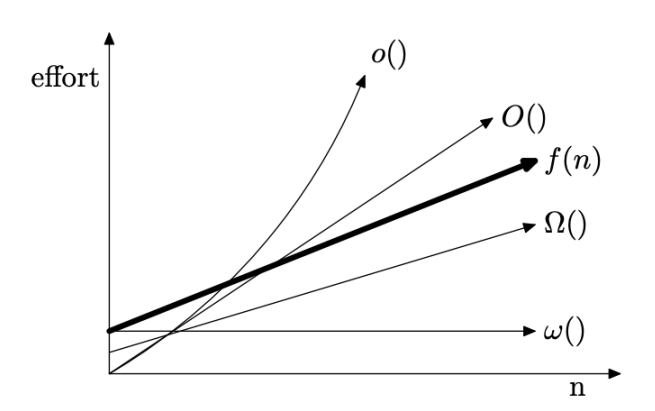

一个算法的上界$O(f(n))$：在所有最坏输入情况下，算法运行时间不会超过$f(n)$

最坏情况(worst case)时间复杂度: 算法求解输入规模为n的实例所需要的最长时间$W(n)$
最好情况(best case)时间复杂度：算法求解输入规模为n的实例所需要的最短时间$W(n)$

一般我们对于一个算法分析会说(一般来说我们更关心worst case)：

- 对于best case，算法的 lower/upper (tight) bound 是$\Theta(f(n))$
- 对于worst case，算法的 lower/upper (tight) bound 是$\Theta(f(n))$

以快排和朴素的素性检测算法为例进行对比，对于素性检测，以输入的数字$n$作为输入：

- 对于快排输入规模为$n$的数组：worst case 下 tight bound $\Theta(n^2)$，best case 下 tight bound $\Theta(n \log n)$
- 对于素性检测：对于一个输入的数字$n$，总是会在确定步数内终止算法，因此对于任何输入$n$，best case 和 worst case都相同，复杂度取决于数字是否有小因子。因此该算法best case 的lower bound 为$\Omega(1)$，upper bound 为$O(\sqrt{n})$；worst case 的lower bound 为$\Omega(1)$，upper bound 为$O(\sqrt{n})$；

### 求解递推方程

求解递推方程：

- 关于阶乘函数：

$$
n! = o(n^n),\qquad n!=\omega(2^n),\qquad \log(n!) = \Theta (n\log n)
$$

- 求和公式：
  $$
  \sum_{k=1}^n \frac{1}{k} = \ln n+O(1)
  $$

  $$
  \sum n^2 = \frac{n(n+1)(2n+1)}{6}
  $$

  

- 主定理：

  设$a\geq 1,b>1$为常数，$f(n)$为函数，$T(n)$为非负整数，且有$T(n) = aT(n/b)+f(n)$

  1. 若$f(n) = O(n^{\log_ba-\epsilon}),\epsilon >0$，那么$T(n)=\Theta(n^{\log_ba})$；
  2. 若$f(n) = \Theta(n^{\log_ba})$，那么$T(n) = \Theta(n^{\log_ba}\log n)$
  3. 若$f(n) = \Omega(n^{\log_ba+\epsilon}),\epsilon >0$，且对于某个**常数$c<1$**和所有充分大的$n$，有$af(n/b)\leq cf(n)$，那么$T(n)=\Theta(f(n))$；

  在主定理中，$n^{\log_ba}$可以看作 total costs of all dividing and merging steps；

  如果$n^{\log_ba -\epsilon}$(**注意这里$n^{\log_ba-\epsilon}$与$n^{\log_ba}$阶是不同的**)是$f(n)$的上界，则整体复杂度就在$n^{\log_ba}$；

  如果$n^{\log_ba+\epsilon}$是$f(n)$的下界，则整体复杂度在$f(n)$（**不过还需要一些额外条件，尤其注意其中r<1**）；

  使用主定理尤其注意两个$\epsilon$，例如$n^{\log_ba}=n$，$f(n)=n\log n$，这种情况下虽然$f(n)$阶更高，但是不存在$\epsilon$使得$f(n)=\Omega (n^{1+\epsilon})$，因此对于类似$T(n)=2T(n/2)+n\log n$形式的递推关系，只能使用递归树求解，结果为

  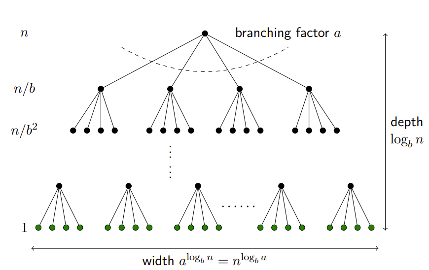

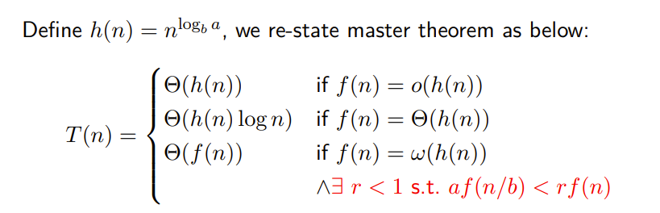

## 动态规划(Dynamic Programing)

### 最长递增子序列(LIS)

1维动态规划。最优子结构：输入的数组记为$L$，前$k$位子串中最长递增子序列长度记作$f(k)$ ，则在已知前$j$位子串LIS长度$f(j)$情况下，其中$j\in [1,k)$，尝试将第$k$位加到第$j$位结尾的最长子串后面，计算$f(k)$；即$f(k) = \max\{f(j)\}+1$，其中$j\in[1,k)$且有$L[k]>L[j]$；考虑递推边界：$f(1) = 1$，从$k = 2$开始递推即可；

第$k$个状态由前$k-1$个状态转移来，==时间复杂度==$O(n^2)$

**track解**: 更新`dp`数组过程中额外记录一下每个位置的前驱位置(若有多个前驱任选一个即可)，时间复杂度$O(n)$

**原始的LIS问题可以使用贪心+二分查找来做**，时间复杂度$O(n\log n)$ [最长上升子序列-LeetCode](https://leetcode-cn.com/problems/longest-increasing-subsequence/solution/zui-chang-shang-sheng-zi-xu-lie-by-leetcode-soluti/)

> 考虑一个简单的贪心，如果我们要使上升子序列尽可能的长，则我们需要让序列上升得尽可能慢，因此我们希望每次在上升子序列最后加上的那个数尽可能的小。
>
> 基于上述思路，维护一个数组$d[i]$表示**长度为$i$的递增子序列结尾最小值**，可证$d$是单调递增的；因此对于第$k$个位置的数字，先比较$v_k$和$d[len]$，其中$len$表示当前LIS长度，如果$v_K>d[len]$，说明当前的数字比LIS结尾数字更大，在LIS结尾追加$v_k$，并且更新$len = len+1$；否则如果$v_k<d[len]$，我们看$v_k$是否会影响递增子序列结尾最小值：扫描$d$，如果$d[j+1]>v_k>d[j]\Longrightarrow d[j] = v_k$；因为已知$d$是严格递增的，因此扫描可以使用二分查找，每次扫描复杂度在$O(\log len)$，整体时间复杂度在$O(n\log n)$

### 最大子段和(MIS)

1维动态规划。最优子结构：记包含第$k$个数的最大子段和为$f(k)$，则可以根据**包含第$k-1$个数的最大子段和**$f(k-1)$计算出$f(k)$。输入的数组记为$A$，递推关系如下：
$$
f(k) =
 \left\{
 \begin{align*}
&f(k-1)+A[k] & f(k-1) >0\\
&A[k]	&f(k-1)\leq0
 \end{align*}
\right.
$$
递推边界$f(0) = 0$

第$k$个状态由第$k-1$个状态转移而来，==时间复杂度==$O(n)$

分治算法求解MIS问题：类似线段树，时间复杂度$O(n\log n)$ [最大子序和-LeetCode](https://leetcode-cn.com/problems/maximum-subarray/solution/zui-da-zi-xu-he-by-leetcode-solution/)

### 图像压缩

1维动态规划。最优子结构：记对包含前k个灰度值的子序列进行压缩的最低存储开销为$f(k)$，则可以根据$f(k-1),f(k-2),\cdots$最多前256个值计算出$f(k)$。输入的灰度值数组记为$A$，递推关系如下：
$$
f(k)=\min\{f(j)+h(A[j+1..k])\}  \qquad \qquad \max\{0,k-256\}<j<k
$$
递推边界为$f(0) = 0$

第k个状态由前$\min\{k-1,256\}$个状态转移而来，因此虽然常数比较大，但==时间复杂度==仍在$O(n)$


### Chain Matrix Multiplication

2维动态规划。最优子结构：因为我们在计算两个矩阵需要的乘法次数时，依赖于左右两个矩阵的大小，因此求解一个问题需要先求解左右两个子问题。设输入的矩阵链为$A$，记对于矩阵链区间$[i,j]$确定乘法次序需要的最少乘法次数为$f(i,j)$，则假定最后一次乘法发生在第$k$个位置($i\leq k< j$)，则有$f(i,k),f(k,j)$也是最优解。因此递推关系如下：
$$
f(i,j) = \min\{f(i,k)+f(k,j)+P_{i-1}P_kP_j\}\qquad\qquad i\leq k<j
$$
递推边界为$f(i,j) = 0~~\mathbf{if}~~i=j$

状态$f(i,j)$由2k个状态转移而来，其中$i\leq k< j$，因此==时间复杂度==$O(n^3)$

### Optimal Binary Search Tree

2维动态规划。最优子结构：如果树是一个最优二分检索树，则左子树和右子树分别是一个最优二分检索树。

与矩阵链乘法类似，对于一个区间$[i,j]$，$f(i,j)$表示该区间内的所有数据点和空隙点构成的二分检索树最小搜索期望，在其中选一个数据点作为根节点，$f(i,j) = f(i,k-1)+f(k+1,j)+h(i,j)$，其中$i\leq k\leq j$时间复杂度$O(n^3)$，

### 投资回报(ROI)

2维动态规划。其实相当于完全背包的变种，可以把完全背包看成有特殊回报函数的ROI问题——在完全背包中，对于物品$k$的选择，其回报函数为$f_k(x) = x\cdot v_k$，也正是由于回报函数的特殊性质，在完全背包中我们可以写出递推关系：
$$
F_k(y) = \max\{F_{k-1}(y),F_{k}(y-w_k)+v_k\}
$$
然而在ROI中，因为对于每种项目的回报函数不是简单的$f(x) = kx$，因此ROI问题的递推关系如下：
$$
\begin{align*}
F_k(y) &= \max\{F_{k-1}(y),F_{k-1}(y-w_k)+f(w_k)~~|~~w_k\in[1,y]\}\\
&= \max\{F_{k-1}(y-w_k)+f(w_k) ~~|~~w_k\in[0,y]\}
\end{align*}
$$
完全背包中对于状态$F_k(y)$的计算只需要1次比较，而ROI需要$y$次比较(类似设计的比较差的那种完全背包的复杂度)。其原因在于ROI中回报函数不是严格单调递增的，因此我们无法确定对于当前状态要对第$k$个项目投资多少才更好，只能尝试所有y种可能。$F_k(y)$由前$y$个状态转移而来，因此对于n个项目，m资本的ROI问题，==时间复杂度==：
$$
\sum_{k=2}^n\sum_{x=1}^m(x+1) = \frac{1}{2}(n-1)m(m+3) = O(nm^2)
$$

**track解**：需要$O(mn)$的空间复杂度，每一格记录对于第k个项目投资了多少钱即可，时间复杂度$O(n)$

```python
i = n # n个项目
j = m # m个硬币
while i > 0:
	if G[i,j] > 0:
        S ∪ {i:G[i,j]}
        j = j-G[i,j]
    i = i-1
```

### 背包问题(knapsack)

#### 0-1背包

N种物品，物品重量记为w，价值记为v；限重W；每个物品选1次；求最大价值。记$F_k(y)$为只装前k物品限重y时最大价值，递推关系如下
$$
F_k(y) = \max\{F_{k-1}(y), F_{k-1}(y-w_k)+v_k\}\qquad y\geq w_k
$$
**空间复杂度优化：**

如果做实现，最简单的是开一个$N\cdot W$的二维数组，但是注意到上面的递推关系中第k行只和第k-1行有关，因此可以做一些空间优化，变成只需要两个$W$长的数组。

更进一步地，可以压缩成1个数组，只需要逆序迭代，且初始置为全0，则计算$F_k(y)$时，数组中$A[y],A[y-w_k]$恰好表示$F_{k-1}(y), F_{k-1}(y-w_k)$

>  **如果要求恰好装满，即变为子集和问题，则应当把$A[0]$置0，其它全置为$-\infin$**

时间复杂度$O(NW)$，空间复杂度$O(W)$

**track解**：时间复杂度$O(W)$，只需要在二维表格$G$中记录下是否选择了第k个物品即可，时间复杂度$O(N)$；

```python
i = N # N种物品
j = w # W限重
while i > 0:
	if G[i,j] == 1:
        S ∪ {i}
        j = j-w_i
    i = i-1
```

#### 完全背包

N种物品，每个物品重量记为w，价值记为v；限重W；每个物品不限次选；求最大价值
$$
F_k(y) = \max \{F_{k-1}(y), F_k(y-w_k)+v_k\}
$$
其中$F_k(y)$表示只装前k种物品，限重为y时的最大价值。

如果按照0-1背包的思路，考虑选第k种物品和不选第k种物品：

- 如果不选第k种物品，则限重不变，转化为$F_{k-1}(y)$
- 如果选第k种物品，则第k种物品至多选$\lfloor W/w_i\rfloor$件，但每多选一件第k种物品，意味着选前k-1种物品时限重要多减去一个$w_i$，因此为了计算$F_k(y)$事实上必须计算所有的$F_{k-1}(y-x_i\cdot w_k)+x_i\cdot v_k$其中$x_i\in [0,\lfloor W/w_i\rfloor]$，然后取$\lfloor W/w_i\rfloor+1$个值中的最大值

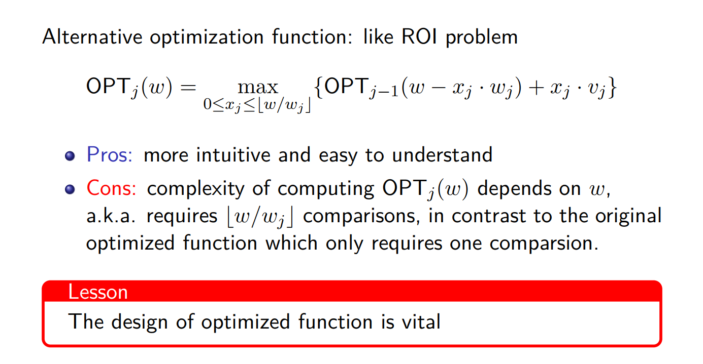

但这样一来计算每个$F_{k-1}(y)$需要做$\lfloor W/w_i\rfloor+1$次比较，时间复杂度$O(NW\sum{\lfloor W/w_i\rfloor+1})$

**可以换一种思路：**

- 如果不选第k种物品，则限重不变，转化为$F_{k-1}(y)$
- 如果选第k种物品，则转化为$F_k(y-w_k)$，注意这里的下标是$k$而不是$k-1$。与0-1不同的原因就在于完全背包允许无限选

因此在对完全背包做**空间复杂度优化**的时候，与0-1也略有不同：

0-1背包的空间复杂度优化需要逆序遍历数组，这是因为在0-1背包中让限重递减：$y = W,W-1,\cdots 1$是为了保证第k次循环中的状态$F_k(y)$是由$F_{k-1}(y-w_k)$递推来，也就是说保证在考虑“**选入第 k 件物品**”这种策略时依据的是一个没有选入第 k 件物品的子结果$F_{k-1(y-w_k)}$；然而完全背包则不同，完全背包中在考虑“**加选一件第 k 件物品**”这种策略时要依赖一个可能已经选入第 k 件物品的子结果$F_k(y-w_k)$，所以需要让限重递增：$y = 1,2,\cdots W-1,W$

**track解**：

### 最长公共子序列(LCS)

2维动态规划。最优子结构：输入两个串记为$X,Y$，长度分别为$m,n$，两者的LCS记为$Z$；设$f(i,j)$表示$X$的前$i$位与$Y$的前$j$位的LCS长度，$Z_p$表示两个子串的LCS：

1. 如果$X_i = Y_j$，则$Z_{p-1}$是$X_{i-1},Y{j-1}$的LCS
2. 如果$X_i \neq Y_j$：
   - 若$X_i = Z_p$，则$Z_{p-1}$是$X_{i-1},Y_{j}$的LCS
   - 若$Y_j = Z_p$，则$Z_{p-1}$是$X_{i},Y_{j-1}$的LCS

由此可建立递推关系:
$$
f(i,j) =
 \left\{
 \begin{align*}
&f(i-1,j-1)+1 & X_i = Y_j\\
&\max\{f(i-1,j),f(i,j-1)\}	&X_i \neq Y_j
 \end{align*}
\right.
$$
递推边界$f(0,j) = f(i,0) = 0$

状态$f(i,j)$至多由前两个状态转移来，时间复杂度$O(mn)$，空间复杂度可以使用两个数组优化到$O(\min\{m,n\})$

[1143. 最长公共子序列 - 力扣](https://leetcode-cn.com/problems/longest-common-subsequence/)

### 最小编辑距离(Edit distance)

2维动态规划。最优子结构：输入两个串记为$X,Y$，长度分别为$m,n$；可知删除和插入的操作是等价的，因此只考虑插入和替换两个操作即可。设$f(i,j)$表示$X$的前$i$位与$Y$的前$j$位的**最小**编辑距离：

1. 如果$X_i = Y_j$，则当前步不需要对两个串进行编辑，$f(i,j) = f(i-1,j-1)$
2. 如果$X_i \neq Y_j$：则当前需要对其中一个串进行编辑，$f(i,j) = f(i-1,j-1)+1$
3. 如果$X_i=\bot$或$Y_j=\bot$：则需要执行相应的插入操作，$f(i,j) = \min\{f(i-1,j)+1,f(i,j-1)+1\}$

因此递推关系：$f(i,j) = \min\{f(i-1,j)+1,f(i,j-1)+1,diff(X_i,Y_j)+f(i-1,j-1)\}$

递推边界$f(0,j) = j,f(i,0) = i$

当前状态$f(i,j)$依赖3个子状态，时间复杂度$O(n^2)$，空间复杂度$O(\min\{m,n\})$

[72. 编辑距离 - 力扣](https://leetcode-cn.com/problems/edit-distance/)

## 计算复杂性理论

### 选择问题

识别出$X$的一个子集$L$

- $X$：一个string集合
- $x$：$X$中的一个元素
- $L$：语言(language)满足特定属性的$X$的一个子集

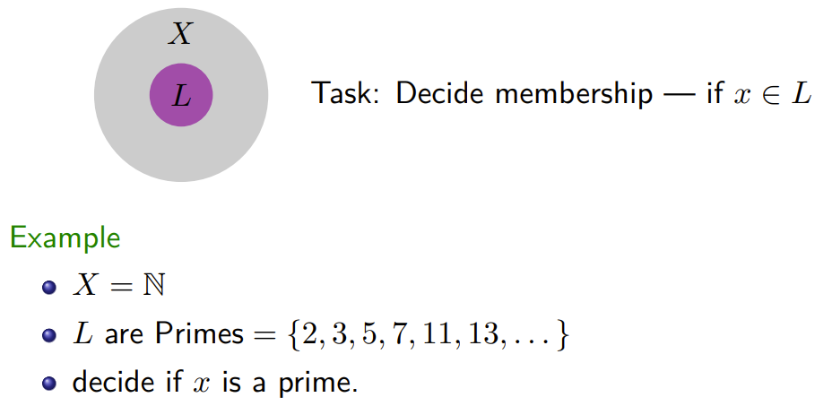

### NDTM v.s. TM

NDTM与标准图灵机类似，除了：

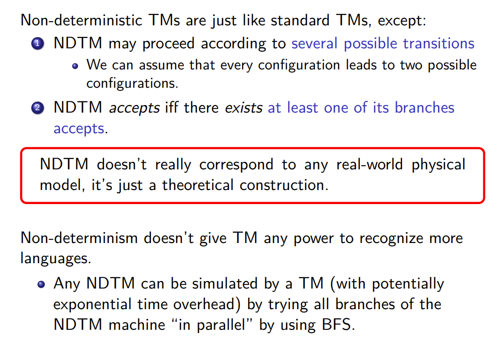


### P和NP

We say a TM $M$ accepts (“1” signify acceptance) a language $L$，if
$$
x\in L\Longleftrightarrow M(x)=1
$$
$L$ is decidable by $M$($M$ solves $L$)

P类语言和NP类语言由 $M$ 是确定性图灵机还是非确定性图灵机进行分类：

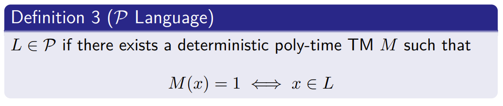

- P类语言: 一个语言L属于P类——如果存在<u>确定型多项式时间图灵机</u>接受L

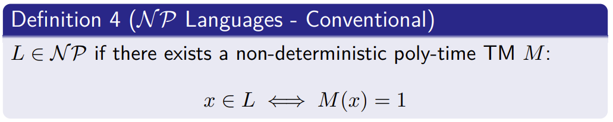

- NP类语言: <u>非确定性图灵机</u>在多项式时间求解$x\in L$

poly-time：最多执行$p(n)$步，其中$P(\cdot)$表示一个多项式，$n$是输入纸带的长度

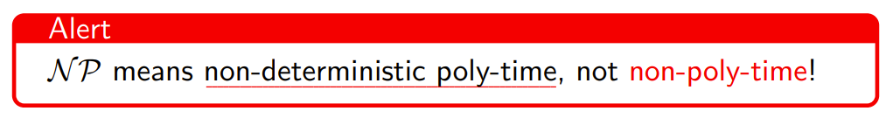

NP问题的modern定义:

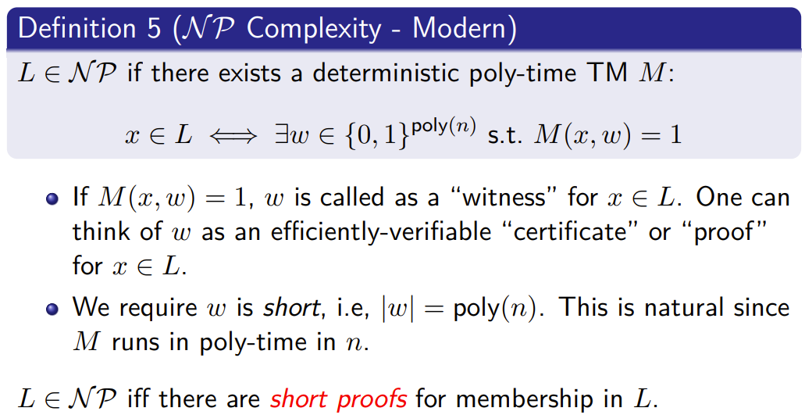

- 即NP语言: 确定性图灵机在多项式时间内验证一个解(即定义中的 witness $w$)

**NP Language的几个例子：**

1. $L=$ 合数(同时这也是一个P language)

2. SAT: 对于给定的合取范式(CNF)，判断是否有一组输入使表达式值为true

   3-SAT: 对于一个子句长度限定为3的合取范式(CNF)，判断是否有一组输入使表达式值为true

   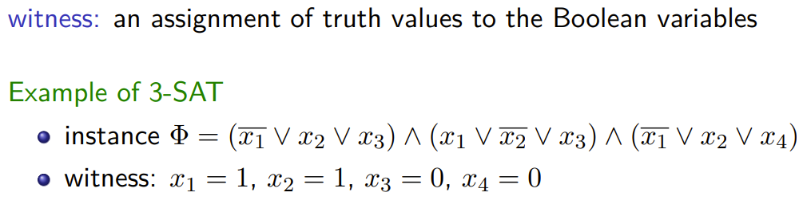

3. 哈密顿路径: 无重复访问无向图上每个节点

   一个不是NP问题的例子：**一个图中是否不存在Hamilton回路**，注意到这个问题无法在多项式时间内验证；


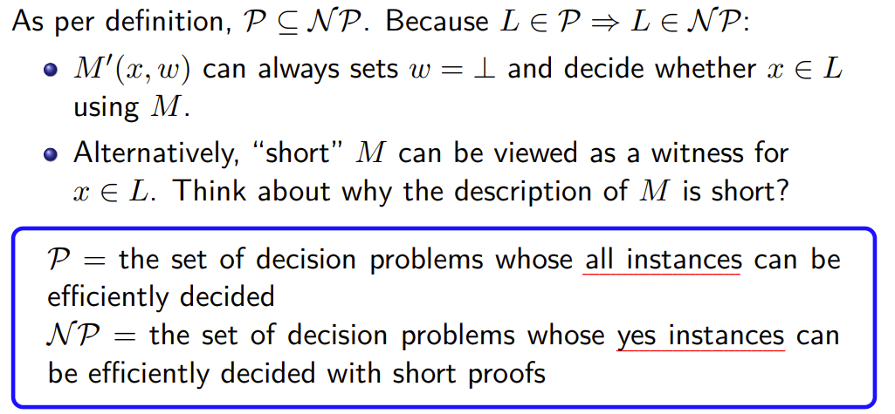

### NP-Complete

- 一个语言L是**NP-Hard**——如果所有的NP语言L' 都能通过一个确定性多项式时间归约算法R归约到L：

> L is said to be NP-hard if for every NP-language L', there is a deterministic poly-time algorithm (a reduction) R:
> $$
> x\in L' \Longleftrightarrow R(x)\in L
> $$

所有的NP类中的问题难度不会超过NP-hard类中的问题，但注意NP-hard中的问题不一定属于NP

- 一个语言L是**NP-Complete**——如果它是NP-hard且它属于NP类()

> L is NP-complete if it is NP-hard, and is itself in NP

NP-Complete 代表了NP问题中最难的一类问题；换句话说，如果我们找到了一个解决NPC问题的多项式时间算法，那么我们就可以在多项式时间解决所有NP问题(从而也说明了P=NP)：

> Suppose Y ∈ N P-complete, then Y ∈ P ⇐⇒ P = N P：
>
> - 必要性：根据NPC定义，NPC问题是NP问题，又因为P=NP，因此$Y\in P$
> - 充分性：根据NPC定义，$\forall X\in NP,X\leq_p Y$，又因为$Y\in P$，因此$NP\in P$，而已知$P\in NP$，因此$P=NP$


P, NP, NP-Hard, NP-Complete的关系：

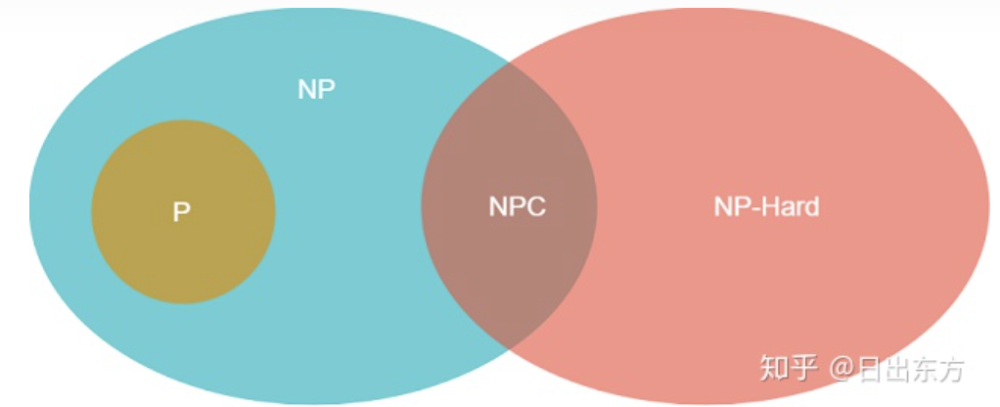


### BPP

- 概率多项式图灵机：

  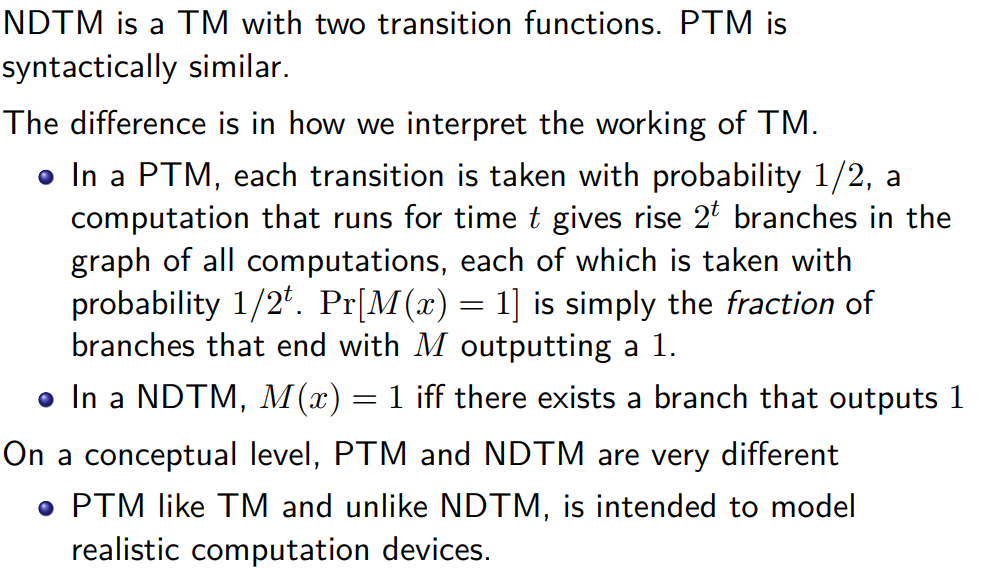

- 一个语言L属于**BPP**类——当且仅当存在一个概率多项式时间图灵机M使得：
  $$
  \forall x\in L: Pr[M(x)=1]\geq \alpha\\
  \forall x\notin L: Pr[M(x)=1]\leq \beta
  $$
  **B**ounded-error **P**robabilistic **P**olynomial Time

  显然$P\in BPP$因为确定型图灵机是一类特殊的概率图灵机

  许多问题属于BPP但不属于P，不过这类问题正在逐渐减少，有猜想$P=BPP$：比方说AKS算法出现之前，素性检测被认为属于BPP而不属于P

- 降低错误(Reduce error)：

  只要错误的概率小于1/2，就可以通过重复多次后，取majority结果作为最终结果来降低错误概率，理论依据是切尔诺夫界(Chernoff bound):

- BPP 和 ZPP：

  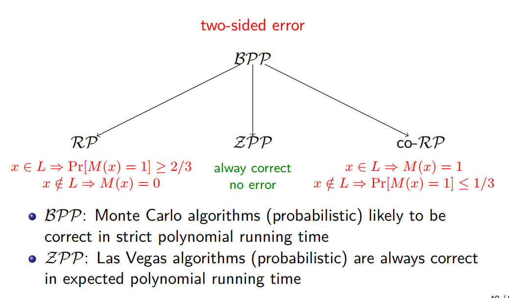

  有效的拉斯维加斯算法又称**ZPP**类；有效的蒙特卡洛算法称为**BPP**类；

  前者是零错误概率多项式时间期望的概率算法；

  而后者是错误概率有界的多项式时间算法，又分为单侧错误和双侧错误，单侧错误可分为弃真和存伪：

  - 其中有效的弃真型单侧错误随机算法又称为**RP**类；宣布接受$\Longrightarrow$一定正确，宣布拒绝$\Longrightarrow$有可能错误

    重复多次，有一次接受就是正确

  - 其中有效的存伪型单侧错误随机算法又称为**co-RP**类；宣布拒绝$\Longrightarrow$一定正确，宣布接受$\Longrightarrow$有可能错误

    重复多次，有一次拒绝就是错误