# 编译原理
> - 本篇内容参考hit mooc 和 [Stanford CS143 *Compilers*](http://web.stanford.edu/class/cs143/)
>
> - 实践内容使用[LLVM 官方文档教程](https://llvm.org/docs/tutorial/index.html) 和 [PKU 编译实践](https://pku-minic.github.io/online-doc/#/)

## 1. 程序设计语言及其文法
💡**本章关注在计算机中如何表示语言及文法**

### 1.1. 基本概念
1. 字母表(alphabet) $\Sigma$ 是一个有穷符号集合。例如:
      - 二进制字母表: $\{0, 1\}$
      - Unicode 字符集

2. 字母表上的运算
      - **乘积**: $\Sigma_1 \Sigma_2 = \{ab | a \in \Sigma_1 , b \in \Sigma_2\}$
      - **次幂**: $\Sigma^0 = \epsilon$ 即空串
      - **正闭包(positive closure)**: $\Sigma^+ = \Sigma \bigcup \Sigma^2 \bigcup \Sigma^3 \cdots$ 即字母表的正闭包：长度正数的符号串构成的集合
      - **克林闭包(Kleene closure)**: $\Sigma^* = \Sigma^+ \bigcup \Sigma^0$ 即字母表的克林闭包：任意符号串(**可为空串**)构成的集合
3. 串(String)
      - 设 $\Sigma$ 是一个字母表， $\forall x\in \Sigma^*$, $x$ 称为是 $\Sigma$ 上的一个 串
      - 串$s$的长度$|s|$指$s$符号的个数
      - 空串是长度为0的串，用$\epsilon$表示
4. 串上的运算
      - **连接(concatenation)**: 例，如果 x = dog 且 y = house ，那么 xy = doghouse
      - **幂**: $s^1 = s^0s = \epsilon s = s,~s^2 = ss,~s^3 = sss$

### 1.2. 文法的定义
文法的形式化定义如下：

$G = (V_T, V_N, P, S)$

- $V_T$: 终结符集合(terminal symbol) 是文法所定义的语言的基本符号，有时称为 token。

    例如 $V_T = \{apple, boy, eat, little\}$

- $V_N$: 非终结符集合(nonterminal) 是用来表示语法成分的符号，有时也成为语法变量

    例如 $V_N = \{<句子>, <名词短语>, <动词短语>, <名词>, \cdots\}$

- $P$: 产生式集合(production) 描述了将终结符和非终结符组合成串的方法。

    产生式的一般形式：$\alpha \rightarrow \beta$

    读作$\alpha$定义为$\beta$。其中$\alpha\in (V_T\bigcup V_N)^+$ 且 α 中至少包含 $V_N$ 中的一个元素：称为产生式的**头部**或**左部**；而其中$\beta\in (V_T\bigcup V_N)^*$：称为产生式的**体**或**右部**

- $S$: 开始符号，$S\in V_N$，表示的是该文法中最大的语法成分

    例如： $S\in <句子>$

下图是一个简化版的算术表达式文法，该文法中只有一个非终结符$E$代表 **表达式expression**；有左括号，右括号，加号等终结符：

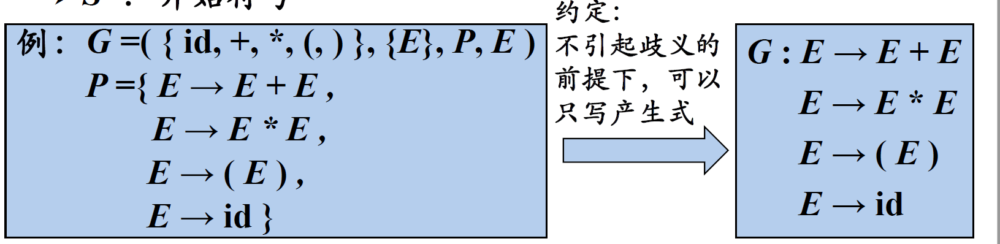

**符号约定：**

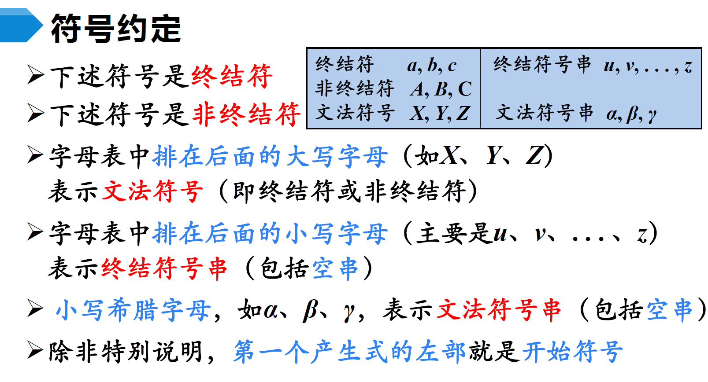

### 1.3. 语言的定义
在有了文法(语言规则)之后，如何判断某一词串是否是该语言的句子？

- 句子的 **推导(derivations)**(即用产生式的右边替换产生式的左边) 从 生成 语言的角度 来判断
- 句子的 **归约(Reductions)**(即用产生式的左边替换产生式的右边) 从 识别 语言的角度 来判断

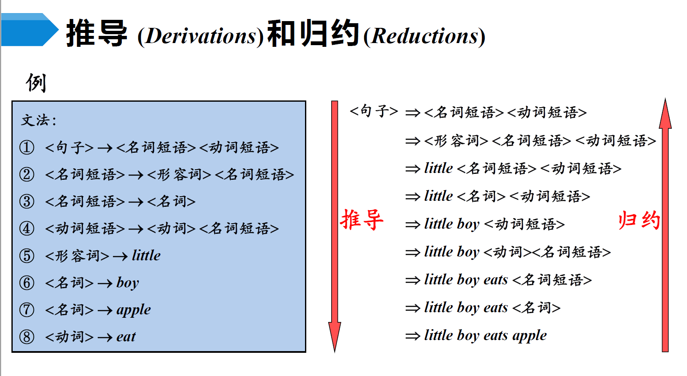

- 如果 $S \Rightarrow^* \alpha$, $\alpha\in (V_T \bigcup V_N)^*$ 则称$\alpha$是文法$G$的一个句型(sentential form)。**句型中可以包含终结符和非终结符**
- 如果一个句型中没有非终结符，则其是一个句子(sentence)
- <u>由文法$G$的开始符号$S$推出的所有**句子**构成的集合称为**文法G生成的语言**，记作$L(G)$</u>

!!! note
    $E \rightarrow E+E | E*E | (E) | id$ 生成的语言中包含无穷个句子。

    可以看到，文法通过递归的定义解决了无穷语言的有穷表示问题。

🚀<u>下面是一个语言的例子</u>：

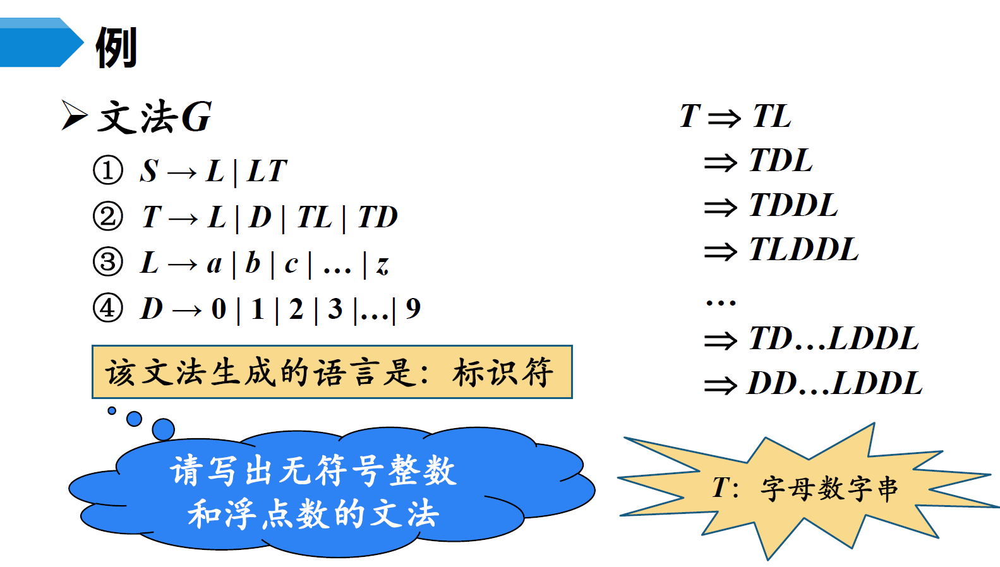

### 1.4. 文法的分类

Chomsky 文法分类

- 0型文法(Type 0 Grammar)

    - 无限制文法(Unrestricted Grammar)/短语结构文法(Phrase Structure Grammar, PSG)

    - $\forall \alpha \rightarrow \beta \in P$, $\alpha$中至少包含一个非终结符

- 1型文法(Type 1 Grammar)
  
    - **上下文有关文法(Context Sensitive Grammar, CSG)**

    - $\forall \alpha \rightarrow \beta \in P$, $|\alpha| \leq |\beta|$

    - 产生式的一般形式：$\alpha_1 A \alpha_2 \rightarrow \alpha_1 \beta \alpha_2$ 其中 $\beta \neq \epsilon$，因为$\alpha$至少包含一个非终结符，因此其长度至少为1，$\beta$的长度因此大于0

- 2型文法(Type 2 Grammar)

    - **上下文无关文法(Context-Free Grammar, CFG)**

    - $\forall \alpha \rightarrow \beta \in P$, $\alpha \in V_N$

    - 产生式的一般形式：$A \rightarrow \beta$ 其中 $A$ 遵循前面的定义，表示非终结符(即将A替换成β不需要考虑上下文)

- 3型文法(Type-3 Grammar)

    - **正则文法(Regulatr Grammar, RG)**
    
    - **右线性(Right Linear)文法**: $A\rightarrow wB | w$， 其中$w$遵循前面的约定表示终结符号串，$B$表示非终结符
    
    - **左线性(Left Linear)文法**: $A\rightarrow Bw | w$， 其中$w$遵循前面的约定表示终结符号串，$B$表示非终结符
    
    - 左线性文法和右线性文法都称为正则文法。即在正则文法中，产生式的**右部最多只有一个**非终结符，而且终结符必须在同一侧

    🚀<u>关于正则语法的一个例子(生成标识符):</u>

    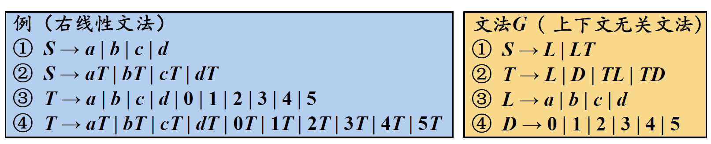

💡**四种文法之间的关系**： 正则文法能表示的最少，无限制文法能表示的最多。 任何一个正则语言都是一个上下文无关语言，但反过来不成立。也就是说，存在一些上下文无关语言不能由正则文法产生。

> new bing 的回答：
>
> - 0型文法是最强大的一种文法，它没有任何限制，可以描述任何一个图灵可识别的语言。0型文法对应于图灵机，它们具有最高的计算能力。
>
> - 1型文法是一种上下文有关的文法，它要求产生式左边的长度不能超过右边。1型文法可以描述一些无限且复杂的语言，比如自然语言。1型文法对应于线性有界非确定图灵机，它们具有较高的计算能力。
>  
> - 2型文法是一种上下文无关的文法，它要求产生式左边只能有一个非终结符。2型文法可以描述一些简单且规则的语言，比如程序设计语言。2型文法对应于下推自动机，它们具有中等的计算能力。
>  
> - 3型文法是一种正则或右线性或左线性的文法，它要求产生式右边只能有一个非终结符，并且在最右或最左位置。3型文法可以描述一些有限且简单的语言，比如标识符或常数。3型文法对应于有限状态自动机或正则表达式，它们具有最低的计算能力。
> 
> 四种类型之间存在包含关系：0型>1型>2型>3型。
> 

### 1.5. CFG的分析树

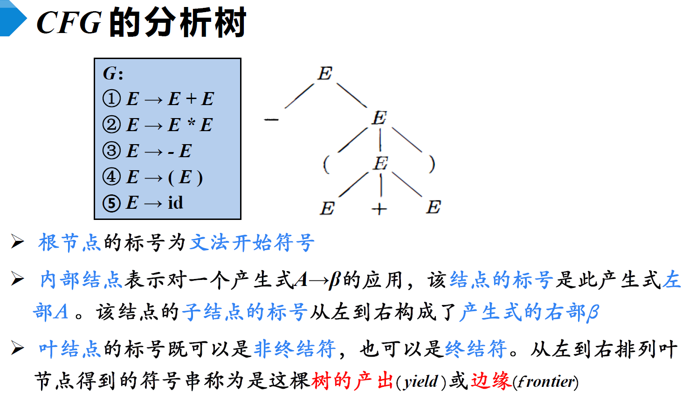

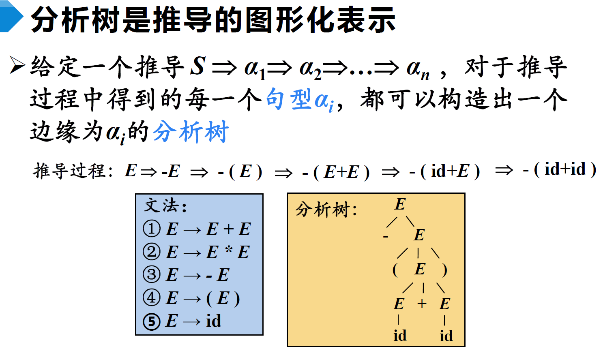

**<u>二义性文法(Ambiguous Grammar)</u>**:

如果一个文法可以为某个句子**生成多棵分析树**，则称这个文法是**二义性**的。

🚀<u>下面是一个存在二义性的文法，以及通过添加额外的消歧规则，确定唯一推导的例子</u>：

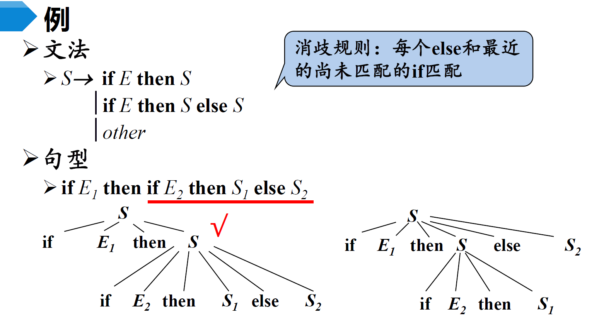

对于任意一个上下文无关文法，不存在一个算法，判定它是无二义性的；但能给出一组 充分条件，满足这组充分条件的文法是无二义性的。

## 2. 词法分析

### 2.1. 正则表达式和正则定义
程序语言中的大多数单词，都可以用正则文法来描述。正则表达式(Regular Expression, RE)是一种描述**正则语言**的更紧凑的方法。**正则表达式和正则文法是等价的**。

正则表达式可以由较小的正则表达式按照特定规则递归地构建。每个正则表达式r定义（表示）一个语言，记为$L(r)$。这个语言也是根据r的子表达式所表示的语言递归定义的。其正式定义如下：

- $\epsilon$ 是一个RE， $L(\epsilon) = \{\epsilon \}$
- 如果$a\in \Sigma$， 则$a$是一个RE，$L(a) = \{a\}$
- 假设$r$和$s$都是RE，表示的语言分别是$L(r)$和$L(s)$， 则
    - $r|s$ 是一个RE, $L(r|s) = L(r)\bigcup L(s)$
    - $rs$ 是一个RE, $L(rs) = L(r)L(s)$
    - $r*$ 是一个RE, $L(r*) = (L(r))*$
    - $(r)$ 是一个RE, $L((r)) = L(r)$
  
    上面提到的运算优先级依次是 *、 连接、 |

!!! note "🚀<u>一个正则表达式的例子</u>"
    - 十进制整数的RE:

        $(1|\cdots|9)(0|\cdots|9)^*|0$
    
    - 八进制整数的RE:
    
        $0(0|1|2|3|4|5|6|7)(0|1|2|3|4|5|6|7)^*$
    
    - 十六进制整数的RE
    
        $0x(0|1|\cdots|9|a|\cdots|f|A|\cdots|F)(0|\cdots|9|a|\cdots|f|A|\cdots|F)^*$

**正则定义(RegularDefinition)**是指，给一些RE命名，并在之后的RE中像使用字母表中的符号一样使用这些名字。

正则定义是具有如下形式的定义序列：$d_1 \rightarrow r_1, d_2 \rightarrow r_2, \cdots, d_n \rightarrow r_n$ 。 

- 其中每个$d_i$都是一个新符号，不在字母表$\Sigma$中，而且各不相同；
- 每个$r_i$是字母表$\Sigma\bigcup {d_1,\cdots, d_{i-1}}$ 上的正则表达式。

!!! note "🚀<u>C语言中标识符的正则定义例子</u>"
    - $digit \rightarrow 0|1|2|\cdots|9$
    - $letter\_ \rightarrow A|B|\cdots|Z|a|b|\cdots|z|\_$
    - $id \rightarrow letter\_(letter\_|digit)^*$

### 2.2. 有穷自动机(FA)
> new bing:
>
> - FA模型是有限状态自动机的简称，它是一种最简单的计算机模型，**只能识别正则语言**。FA模型由一个有限的状态集合、一个输入符号集合、一个初始状态、一个终止状态集合和一个转移函数组成。FA模型在每个时刻只能处于一种状态，并根据输入符号和转移函数来改变状态。
>
> - 图灵机模型是一种最强大的计算机模型，可以识别任何可计算的语言。图灵机模型由一个无限长的纸带、一个读写头、一个有限的控制规则和一个有限的状态集合组成。图灵机模型在每个时刻可以读取或写入纸带上的符号，并根据控制规则和当前状态来改变位置和状态。

有穷自动机( Finite Automata，FA )由两位神经物理学家MeCuloch和Pitts于1948年首先提出，是对一类处理系统建立的数学模型。

这类系统具有一系列离散的输入输出信息和**有穷数目的内部状态**（状态：概括了对过去输入信息处理的状况）。系统只需要根据**当前所处的状态**和**当前面临的输入**就可以决定系统的后继行为。每当系统处理了当前的输入后，系统的内部状态也将发生改变。

- FA的表示：**转换图(Transition Graph)**

    - **结点**：FA的状态

        - 初始状态（开始状态）：只有一个，由start箭头指向
        - 终止状态（接收状态）：**可以有多个**，用双圈表示

    - **带标记的有向边**：如果对于输入a，存在一个从状态p到状态q的转换，就在p、q之间画一条有向边，并标记上a

    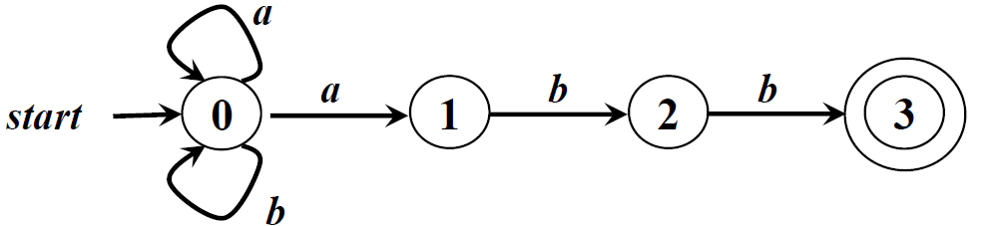

- FA定义（接收）的语言

    - 给定输入串x，如果存在一个对应于串x的从初始状态到某个终止状态的转换序列，则称串x被该FA接收
    - 由一个有穷自动机**$M$接收的所有串构成的集合称为是该FA定义（或接收）的语言**，记为$L(M)$

    🚀<u>下面是一个**非确定型**(后面会解释)有穷自动机接受语言的例子</u>
    
    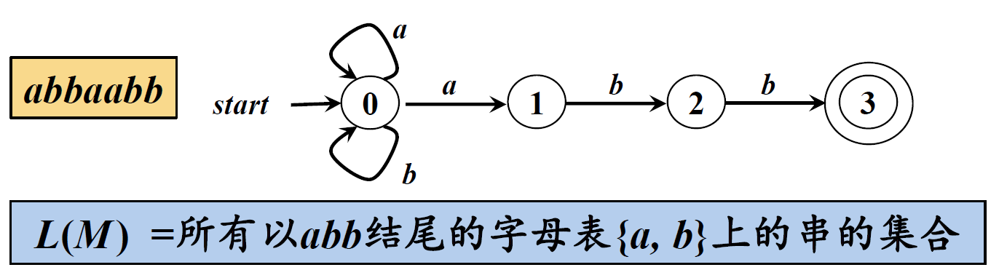

- FA的最长子串匹配原则(LongestString MatchingPrinciple)
    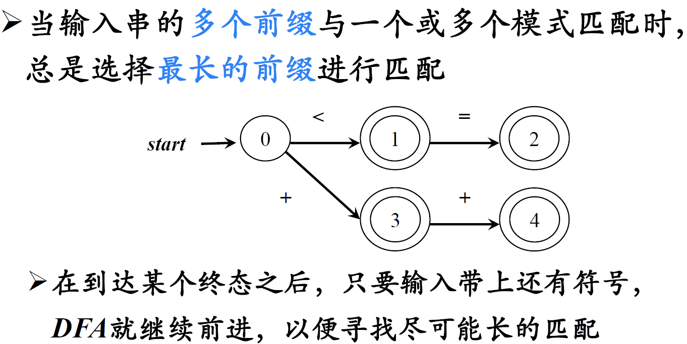

    如果输入 <= 符号，则以状态2为终结状态，而不是仅匹配到状态1

- FA的分类

    - 确定的FA(Deterministic finite automata, DFA)

        ➡ 在一个确定状态对于给定输入，转移到**一个特定状态**

    - 非确定的FA(Nondeterministic finite automata, NFA)
    
        ➡ 在一个确定状态对于给定输入，可能**转移到多个状态**

        带有和不带有“ε-边”(空边)的NFA 也是等价的，可以相互转换

    DFA和NFA两者是等价的，可以相互转换

**正则文法⇔正则表达式⇔FA** 。 接下来我们考虑如何将一个正则表达式表示成FA，通常我们会首**先将正则表达式表示成NFA，再将NFA转化成计算机更容易实现的DFA**。最终我们希望能够使用DFA对源码进行词法解析。

具体来说，正则表达式中的连接运算，或运算，克林闭包这三种运算在有穷自动机中的对应关系如下：

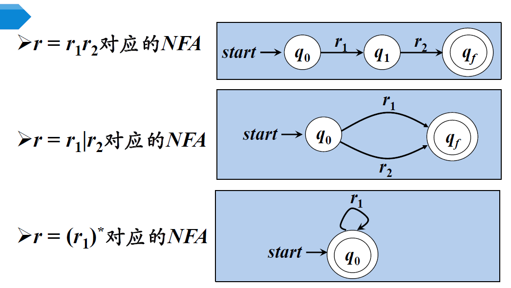

🚀<u>一个例子 $(a|b)^*abb$ 对应的NFA：</u>

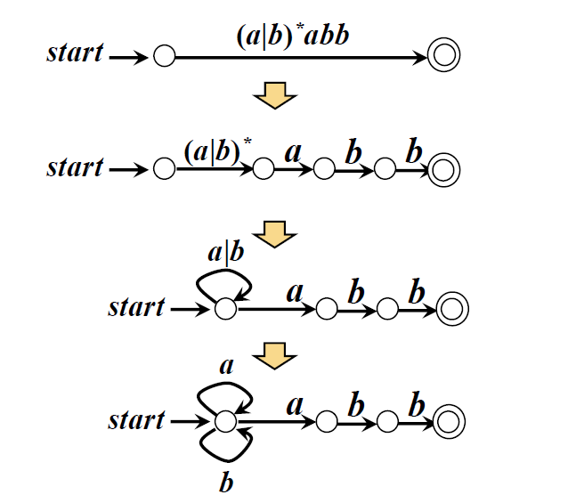

### 2.3. NFA到DFA的转换
**这里介绍子集构造法：**

通常我们先写出NFA的转换表。NFA中一个状态可能在一个输入下转移到多个状态，直接把所有可能转移的状态构造成DFA的一个新的状态即可，这样一来，DFA的每个状态都是一个由NFA中的状态构成的集合,即NFA状态集合的一个子集。

🚀<u>一个例子：</u>

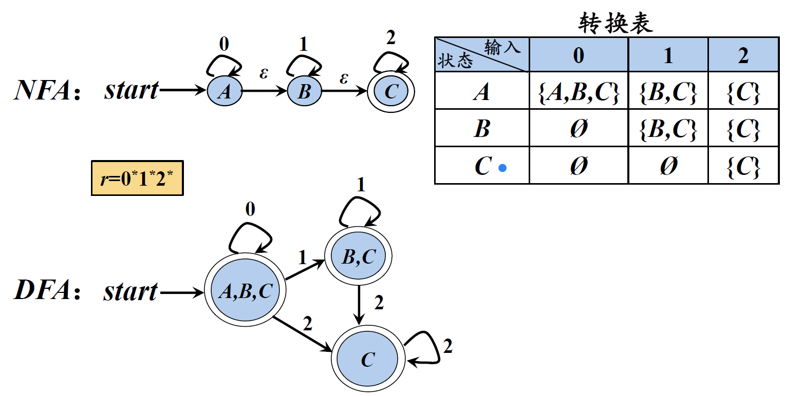

因为上图的NFA中含有空边，因此对于start状态，遇到输入0之后，可以转移到A、B、C中的任意一个状态

## 3. 语法分析

### 3.1. 自顶向下

### 3.2. 自底向上
