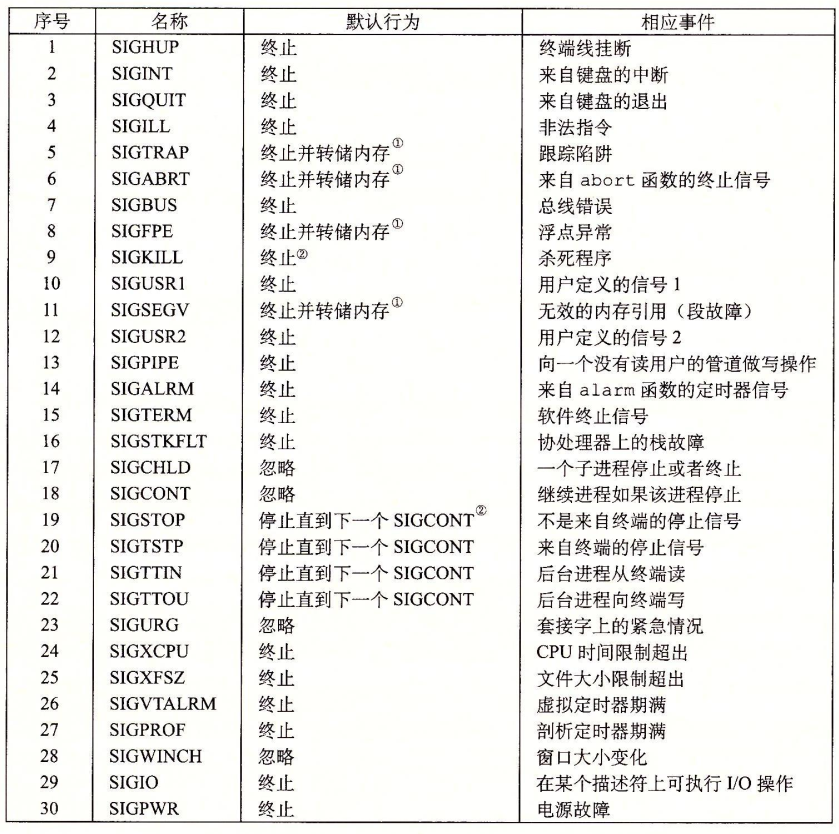
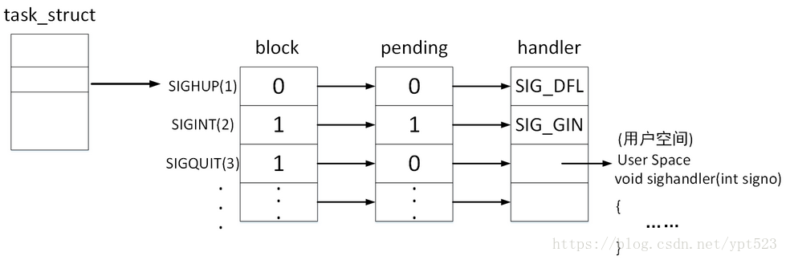

# Signal

> **Ref**:
> 本文参考CSAPP8.5节

## 什么是信号(Signal)

在CSAPP第8章异常控制流(ECF)中，首先介绍了低层异常机制，如软硬件合作中涉及的**中断**，然后介绍了**上下文切换**这种异常控制流形式。信号也是一种异常控制流形式，是更高层级——软件层面的，和前面的异常控制流类似，信号允许进程和内核中断其它进程。

一个信号就是一条小消息，它通知进程系统中发生了一个某种类型的事件。比如，下图展示了Linux系统上支持的**30种**不同类型的信号。



每种信号类型都对应于某种系统事件。低层的硬件异常是由内核异常处理程序处理的，正常情况下，对用户进程而言是不可见的。信号提供了一种机制，通知用户进程发生了这些异常。比如，如果一个进程试图除以0，那么内核就发送给它一个`SIGFPE`信号(号码8)。如果一个进程执行一条非法指令，那么内核就发送给它一个`SIGILL`信号(号码4)。如果进程进行非法内存引用，内核就发送给它一个`SIGSEGV`信号(号码11)。其他信号对应于内核或者其他用户进程中较高层的软件事件。比如，如果当进程在前台运行时，你键入Ctrl+C(也就是同时按下Ctrl键和C键)，那么内核就会发送一个 `SIGINT`信号(号码2)给这个前台进程组中的每个进程。一个进程可以通过向另一个进程发送一个`SIGKILL`信号(号码9)强制终止它。当一个子进程终止或者停止时，内核会发送一个`SIGCHLD`信号(号码17)给父进程。

## 信号的传送

传送一个信号到目的进程是由两个不同步骤组成的:

- **发送信号**。内核通过更新目的进程上下文中的某个状态，发送(递送)一个信号给目的进程。发送信号可以有如下两种原因:
  1. 内核检测到一个系统事件，比如除零错误或者子进程终止。
  2. 一个进程调用了`kill`函数(在下一节中讨论)，显式地要求内核发送一个信号给目的进程。一个进程可以发送信号给它自己。
- **接收信号**。当目的进程被内核强迫以某种方式对信号的发送做出反应时，它就接收了信号。进程可以忽略这个信号，终止或者通过执行一个称为信号处理程序(signal handler)的用户层函数捕获这个信号。下图给出了信号处理程序捕获信号的基本思想。


信号实际上有三种可能的状态：

* 信号递达(Delivery)：实际执行信号的处理动作
* 信号未决(Pending)：信号从产生到递达之间的状态
* 信号阻塞(Block)：进程可以选择阻塞某个信号，被阻塞的信号产生时将保持在Pending状态，直到进程解除对此信号的阻塞，才执行递达的动作

**注意：**阻塞和忽略是不同的，只要信号被阻塞就不会递达，而忽略是在抵达之后可选的一种处理动作

信号在内核中的表示可以模拟成下图(图源如水印)：



每个信号都有两个标志位分别表示阻塞（block）和未决（pending），还有一个函数指针用来表示处理动作。信号产生时，内核在PCB中设置该信号的未决状态，直到信号递达才清除该标志。

我们对上述图的各种状态作以分析：

1. `SIGHUP`信号未阻塞也未产生过（未决），当它递达时执行默认处理动作。
2. `SIGINT`信号产生了，但是正在被阻塞（block），所以暂时不能被递达。虽然它的处理动作是忽略，但是在没有解除阻塞之前不能忽略这个信号，因为进程仍有机会改变处理动作之后再解除阻塞。
3. `SIGQUIT`信号未产生过，且一旦产生就阻塞，它的处理动作是用户自定义的信号处理函数`sighandler`。

**常规信号在递达之前产生多次只记一次，而实时信号在递达之前产生多次可依次放在一个队列里面**。

上图中，每个信号只有一个比特位的未决状态，0和1两种，**不记录该信号出现了多少次**，阻塞标志与其类似。因此未决和阻塞标志可以使用相同的数据类型 `sigset_t` 信号集来存储，这个类型可以表示每个信号的有效和无效状态。

上面说到——“当目的进程被内核强迫以某种方式对信号的发送做出反应时，它就接收了信号”，这个接收信号的过程究竟发生在何时？

当内核把进程p从内核模式切换到用户模式时(例如，从系统调用返回或是完成了一次上下文切换)，它会检查进程p的未被阻塞的待处理信号的集合(pending &~blocked)。如果这个集合为空(通常情况下)，那么内核将控制传递到p的逻辑控制流中的下一条指令。然而，如果集合是非空的，那么内核选择集合中的某个信号k(通常是最小的k)，并且强制p接收信号h。收到这个信号会触发进程采取某种行为。一旦进程完成了这个行为，那么控制就传递回p的逻辑控制流中的下一条指令。每个信号类型都有一个预定义的默认行为，是下面中的一种:

- 进程终止
- 进程终止并转储内存
- 进程停止(挂起)直到被`SIGCONT`信号重启
- 进程忽略该信号

例如进程接收到`SIGCHILD`的默认行为就是忽略该信号，`SIGKILL`的默认行为是终止进程，且该默认行为无法被更改，另一个不能被更改的是`SIGSTOP`，其默认行为就是上述第三点。

> `signal`函数可用来改变信号和其对应处理行为的关系：该函数的功能是为一个信号`signum`指定回调`handler`
>
> ```c
> #include <signal.h>
> typedef void (*sighandler_t)(int);
> sighandler_t signal(int signum, sighandler_t handler);
> ```
>
> 一个示例程序如下：
>
> ```c
> #include <stdio.h>
> #include <stdlib.h>
> #include <unistd.h>
> #include <signal.h>
> void handler(int sig) {
>     printf("Bye.\\n");
>     exit(0);
> }
> int main() {
>     signal(SIGINT, handler);
>     while (1) {
>         sleep(1);
>     }
>     return 0;
> }
> ```
>
> 其中`SIGINT` 信号代表由`InterruptKey`产生，通常是CTRL +C 或者是DELETE
>
> 但是Linux manual 中描述这个函数因为例是原因和Unix版本不同会有不同的表现，不推荐使用，推荐使用 `sigaction` 代替之

## 信号的处理

参考：[避免在 Linux 上使用 signals](https://kingsamchen.github.io/2019/09/09/avoid-using-signals-on-linux/)

### 安全的信号处理

一个信号处理程序引起死锁的简单例子：在信号处理程序中使用`printf()`函数，解释如下：

> 在 `printf()` 内部的执行过程中需要先获得输出端（例如 `stdout` ）的锁，然后对输出端进行修改，最后释放输出端的锁。如果在主程序和信号处理程序中均调用了 `printf()` ，那么就有可能发生下述这种情况：
>
> 进程（主程序） *A* 中调用了 `printf()` 函数，在 `printf()` 内部正好执行到临界区代码（即已经获得输出端的锁，但尚未释放该锁）时，内核的进程调度程序中断了进程 *A* 的指令流，并进行进程上下文切换，将控制传递给进程 *B* 。一段时间后，进程调度程序再次进行进程上下文切换，准备将控制传递给进程 *A* 。在将控制传递给进程 *A* 之前，内核会先检查进程 *A* 的未被阻塞的待处理信号的集合。此时，内核发现有一个信号 *k* 未被处理，并且进程 *A* 已经通过 *signal* 函数将接收到信号 *k* 的行为指定为调用信号处理程序 *K* 。因此，控制传递到信号处理程序 *K* 中。在信号处理程序 *K* 中也调用了 `printf()` ，它要求获得输出端的锁，但是输出端的锁已经被进程 *A* 调用的 `printf()` 获得了，尚未释放。此时此刻，进程 *A* 在等待信号处理程序 *K* 的执行结束：只有信号处理程序 *K* 执行完，控制才会传递给进程 *A* ，进程 *A* 才能在后续的指令流中释放输出端的锁；与此同时，信号处理程序 *K* 却阻塞在等待获取输出端的锁，指令流无法前进。由此，产生了死锁。

类似地，如同fork和多线程混用那样，如果在主程序和信号处理程序中同时使用`malloc`之类的函数也可能会造成死锁。本质在于两个程序对全局数据结构的访问(比如，锁)冲突，造成死锁。

### 正确的信号处理

信号的一个与直觉不符的方面是未处理的信号是不排队的。因为pending位向量中每种类型的信号只对应有一位，所以每种类型最多只能有一个未处理的信号。因此，如果两个类型k的信号发送给一个目的进程，而因为目的进程当前正在执行信号k的处理程序，所以信号k被阻塞了，那么第二个信号就简单地被丢弃了;它不会排队。关键思想是如果存在一个未处理的信号就表明至少有一个信号到达了。

要了解这样会如何影响正确性，来看一个简单的示例：

```c
static volatile int running_processes = 0;
void handler(int sig) {
    if (waitpid(-1, NULL, WNOHANG) > 0) {
        running_processes -= 1;
    }
}
int main() {
    signal(SIGCHLD, handler);
    const int num_processes = 10;
    for (int i = 0; i < num_processes; i++) {
        if (fork() == 0) {
            sleep(1);
            exit(0);
        }
        running_processes += 1;
        printf("%d running processes\n", running_processes);
    }
    while(running_processes > 0) {
        pause();
    }
    printf("All processes exited! %d running processes\n", running_processes);
    return 0;
}
```

这个程序可能会一直阻塞，因为多个子进程发送给父进程`SIGCHILD`信号，如果发送信号时，`handler`正在工作，则该信号会丢失。

一个解决的方法就是把第三行的`if`换成`while`

### 可移植的信号处理
