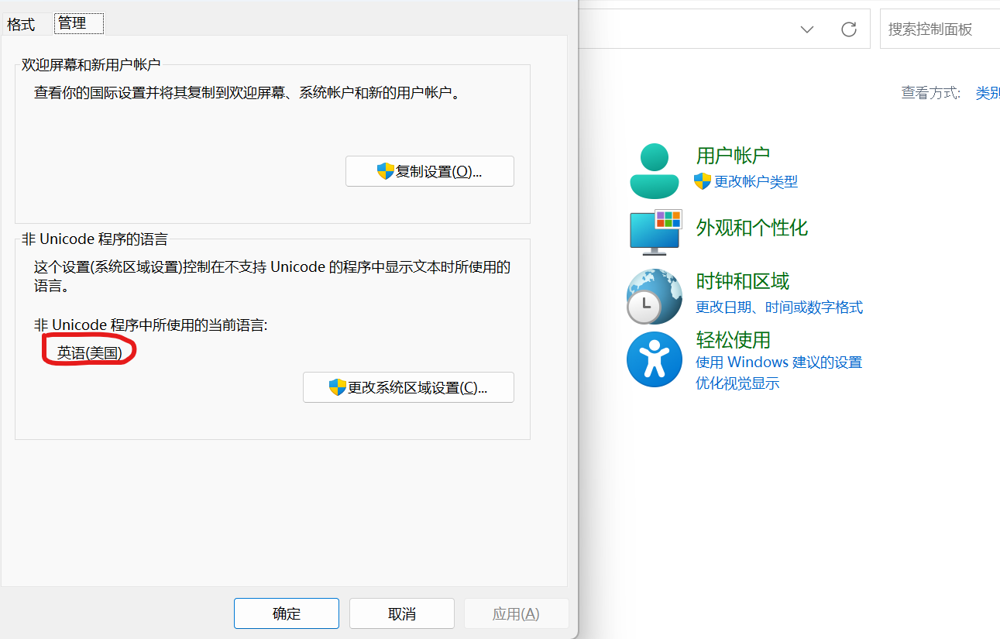

## 安装llvm和clang
首先从llvm官网找到对应版本的源码下载:
[llvm download](https://releases.llvm.org/)

然后进行按照
[get-started](https://clang.llvm.org/get_started.html)
的教程进行编译，
### Windows
windows编译参考其中的**Using Ninja alongside Visual Studio**部分：

1. 打开developer command prompt with the appropriate environment
2. `mkdir build`
3. `cd build`
4. `set CC=cl`
5. `set CXX=cl`
6. `cmake -GNinja -DLLVM_ENABLE_PROJECTS="clang;lldb;clang-tools-extra" -DCMAKE_INSTALL_PREFIX="D:/install" -DLLVM_TARGETS_TO_BUILD=X86 -DCMAKE_BUILD_TYPE=Release ..\llvm`
7. `ninja` // this will build clang
8. `ninja install` // this will install clang

这里设置`LLVM_ENABLE_PROJECTS`指定哪些subproject被build，`extra`中包含`clang-format`等工具

注意这里在win11中文版上编译`clangd`的时候会出现文件编码导致的错误，解决方法：

### Linux
在Debian系的安装参考[llvm-apt-repo](https://apt.llvm.org/)

## Linux 管理多版本工具链
!! TODO

sudo update-alternatives --install /usr/bin/gcc gcc /usr/bin/gcc-9 10 \
    --slave /usr/bin/g++ g++ /usr/bin/g++-9 \

sudo update-alternatives --install /usr/bin/gcc gcc /usr/bin/gcc-12 20 \
    --slave /usr/bin/g++ g++ /usr/bin/g++-12 \
