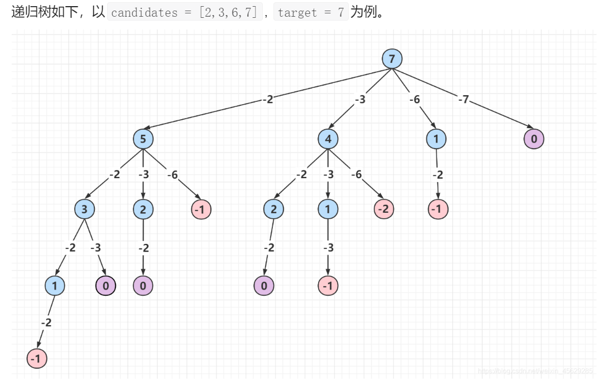

# 刷题记录

## 动态规划

### 1维dp

#### 复杂度$O(n)$

这类题的当前状态由之前的常数个状态转移而来，因此时间复杂度在$O(n)$，只有1层for循环

!!! example
	- 最大字段和MIS: 第i个状态由第i-1个状态转移来
	- 图像压缩: 第i个状态至多由前256个状态转移而来

以[53. 最大子数组和 - 力扣](https://leetcode.cn/problems/maximum-subarray/) MIS为例，实际代码如下：

```C++
int maxSubArray(vector<int>& nums) {
    // dp[i] = if(dp[i-1]<0){ nums[i] } else{ dp[i-1]+nums[i] }
    int n = nums.size();
    int pre_sum{-1}, res{INT32_MIN};
    for(int i=0;i<n;i++){
        pre_sum = pre_sum < 0 ? nums[i] : pre_sum + nums[i];
        res = max(res, pre_sum);
    }
    return res;
}
```

---

**已做过的相关题目：**


- [509. 斐波那契数 - 力扣](https://leetcode.cn/problems/fibonacci-number/) $dp[i] = dp[i-1]+dp[i-2]$；

- [70. 爬楼梯 - 力扣](https://leetcode.cn/problems/climbing-stairs/) 与斐波那契相同，$dp[i] = dp[i-1]+dp[i-2]$；

- [746. 使用最小花费爬楼梯 - 力扣](https://leetcode.cn/problems/min-cost-climbing-stairs/) $dp[i] = \min(dp[i-1], dp[i-2])$；

- [118. 杨辉三角 - 力扣](https://leetcode.cn/problems/pascals-triangle/) $dp[i][j] = dp[i][j-1]+dp[i][j]$，注意边界条件

- [119. 杨辉三角 II - 力扣](https://leetcode.cn/problems/pascals-triangle-ii/) 同上

- [931. 下降路径最小和 - 力扣](https://leetcode.cn/problems/minimum-falling-path-sum/)  $dp[i][j] = val[i][j]+\min (dp[i-1][j-1],dp[i-1][j],dp[i-1][j+1])$

- [120. 三角形最小路径和 - 力扣](https://leetcode.cn/problems/triangle/)  $dp[i][j] = val[i][j]+\min (dp[i-1][j-1],dp[i-1][j])$

- [62. 不同路径 - 力扣](https://leetcode.cn/problems/unique-paths/) $dp[i][j] = dp[i-1][j]+dp[i][j-1])$

- [63. 不同路径 II - 力扣](https://leetcode.cn/problems/unique-paths-ii/) 同上

- [64. 最小路径和 - 力扣](https://leetcode.cn/problems/minimum-path-sum/) 同上，$dp[i][j] = \min(dp[i-1][j], dp[i][j-1])+grid[i][j])$

- [264. 丑数 II - 力扣](https://leetcode.cn/problems/ugly-number-ii/) $dp[i] = \min({dp[p2]*2, dp[p3]*3, dp[p5]*5})$

- [313. 超级丑数 - 力扣](https://leetcode.cn/problems/super-ugly-number/) //!TODO

- [53. 最大子数组和 - 力扣](https://leetcode.cn/problems/maximum-subarray/) MIS，$dp[i] = \texttt{if}(dp[i-1]<0)\quad\{nums[i]\}\quad\texttt{else}\quad\{dp[i-1]+nums[i] \}$

- [152. 乘积最大子数组- 力扣](https://leetcode.cn/problems/maximum-product-subarray/solution/) 类似MIS，但是需要注意转移方程的不同:

    ```python
    dp_max[i] = max(dp_max[i-1]*nums[i], dp_min[i-1]*nums[i], nums[i])
    dp_min[i] = min(dp_max[i-1]*nums[i], dp_min[i-1]*nums[i], nums[i])
    ```

- [1567. 乘积为正数的最长子数组长度- 力扣](https://leetcode.cn/problems/maximum-length-of-subarray-with-positive-product/solution/) 类似MIS，但是需要这题求长度，注意dp数组含义的改变以及转移方程相应调整

    ```python
    dp_pos[i] = if(nums[i]==0)  { 0 }
    			elif(nums[i]<0) { dp_neg[i-1]!=0 ? dp_neg[i-1]+1 : 0 }
    			elif(nums[i]>0) { dp_pos[i-1]+1 }
    dp_neg[i] = if(nums[i]==0)  { 0 }
    			elif(nums[i]<0) { dp_neg[i-1]+1 }
    			elif(nums[i]>0) { dp_neg[i-1]!=0 ? dp_neg[i-1]+1 : 0}
    ```

- [918. 环形子数组的最大和 - 力扣 ](https://leetcode.cn/problems/maximum-sum-circular-subarray/) MIS的变种
  考虑两种情况，第一种情况是最大连续子数组在数组中间，这种类似于53求最大连续子数组；
  第二种情况是最大连续子数组在数组两边，这就需要求出最小连续子数组，然后用数组和减去最小连续子数组；
  
- [198. 打家劫舍 - 力扣](https://leetcode.cn/problems/house-robber/) $dp[i] = max(dp[i-1], dp[i-2]+val[i-2])$
  
- [213. 打家劫舍 II - 力扣](https://leetcode.cn/problems/house-robber-ii/) 对于环形数组分情况讨论（偷第1个 or 不偷第1个）

- [740. 删除并获得点数 - 力扣](https://leetcode.cn/problems/delete-and-earn/) 打家劫舍的变体，通过一些技巧转化为打家劫舍

- [121. 买卖股票的最佳时机 - 力扣](https://leetcode.cn/problems/best-time-to-buy-and-sell-stock/) $dp[i] = \max(dp[i-1],val[i] - pre\_min)$

- [122. 买卖股票的最佳时机 II - 力扣](https://leetcode.cn/problems/best-time-to-buy-and-sell-stock-ii/submissions/) 分两种情况讨论(可以视为2维dp)
	
	```python
	dp_non[i]  = max(dp_non[i-1], dp_hold[i-1]+v_i)
	dp_hold[i] = max(dp_hold[i-1], dp_non[i-1]-v_i)
	"递推边界条件:" dp_non[0] = 0, dp_hold[0] = -v_0
	```
  
- [309. 最佳买卖股票时机含冷冻期 - 力扣](https://leetcode.cn/problems/best-time-to-buy-and-sell-stock-with-cooldown/) 

- [714. 买卖股票的最佳时机含手续费 - 力扣](https://leetcode.cn/problems/best-time-to-buy-and-sell-stock-with-transaction-fee/) 与122相同，多了手续费，对递推关系稍加修改

- [413. 等差数列划分 - 力扣](https://leetcode.cn/problems/arithmetic-slices/) 

    ```haskell
    dp[i] = if(nums[i]-nums[i-1] == nums[i-1]-nums[i-2]){ dp[i-1]+1 } else{ 0 }
    ```
    
- [91. 解码方法 - 力扣](https://leetcode.cn/problems/decode-ways/)

    ```haskell
    dp[i] = dp[i-1] + dp[i-2] if s[i..i+1] and s[i-1..i+1]
    ```
    
- [42. 接雨水 - 力扣](https://leetcode.cn/problems/trapping-rain-water/) 
	
    ```haskell
    cur[i] = min(left_max[i], right_max[i])-height[i]
    left_max[i] = max(height[i], left_max[i-1])
    right_max[i] = max(height[i], right_max[i+1])
    ```

#### 复杂度$O(n^2)$

这类题目第i个状态由前$\Theta(i-1)$个状态转移来，有2层for循环

!!! example
	- 最长递增子序列(LIS): 输入的数组记为$L$，前$k$位子串中最长递增子序列长度记作$f(k)$ ，则在已知前$j$位子串LIS长度$f(j)$情况下，其中$j\in [1,k)$，尝试将第$k$位加到第$j$位结尾的最长子串后面，计算$f(k)$；即$f(k) = \max\{f(j)\}+1$，其中$j\in[1,k)$且有$L[k]>L[j]$；考虑递推边界：$f(1) = 1$，从$k = 2$开始递推即可

---

**已做过的相关题目：**

- [300. 最长递增子序列 - 力扣](https://leetcode.cn/problems/longest-increasing-subsequence/) LIS

    ```haskell
    dp[i] = max(dp[j])+1 for j in [0..i] && nums[j]<nums[i]
    ```
    
- [139. 单词拆分 - 力扣](https://leetcode.cn/problems/word-break/) 

    ```haskell
    dp[i] = dp[j] && s[j..i]  for j in [0..i]
    ```
    
- [96. 不同的二叉搜索树 - 力扣](https://leetcode.cn/problems/unique-binary-search-trees/)

    ```haskell
    dp[i] = sum(dp[j]*dp[i-j-1]) for j in [0..i]
    ```


### 2维dp

!!! example
    - 最长公共子序列LCS
    - 最小编辑距离Edit distance
    - 投资回报ROI
    
    $$
    \begin{align*}
    F_k(y) &= \max\{F_{k-1}(y),F_{k-1}(y-w_k)+f(w_k)~~|~~w_k\in[1,y]\}\\
    &= \max\{F_{k-1}(y-w_k)+f(w_k) ~~|~~w_k\in[0,y]\}
    \end{align*}
    $$

---

**已做过的相关题目：**

- [1314. 矩阵区域和 - 力扣](https://leetcode.cn/problems/matrix-block-sum/) **2维前缀和**；前缀和矩阵实现时增加额外1行1列全0，定义`get`方法，简化代码

    ```haskell
    "前缀和数组：" dp[i][j]=dp[i][j-1]+dp[i-1][j]-dp[i-1][j-1]+val[i][j]
    ```

- [304. 二维区域和检索 - 矩阵不可变 - 力扣](https://leetcode.cn/problems/range-sum-query-2d-immutable/) 同上，**2维前缀和**

- [1292. 元素和小于等于阈值的正方形的最大边长 - 力扣](https://leetcode.cn/problems/maximum-side-length-of-a-square-with-sum-less-than-or-equal-to-threshold/) 同上，**2维前缀和**

- [1277. 统计全为 1 的正方形子矩阵 - 力扣](https://leetcode.cn/problems/count-square-submatrices-with-all-ones/) ⭐`dp[i][j]`表示以`(i,j)`为右下角最大正方形边长

    ```haskell
    dp[i][j] = min(dp[i-1][j],dp[i][j-1],dp[i-1][j-1])+1 -- if matrix[i][j]==1
    ```

- [221. 最大正方形 - 力扣](https://leetcode.cn/problems/maximal-square/) 同上

    ```haskell
    dp[i][j] = min(dp[i-1][j],dp[i][j-1],dp[i-1][j-1])+1 -- if matrix[i][j]==1
    ```
    
- [5. 最长回文子串 - 力扣](https://leetcode.cn/problems/longest-palindromic-substring/) ⭐回文串去掉两端后仍是回文串；复杂度$O(n^2)$

    ```haskell
	dp[i][j] = dp[i+1][j-1] && s[i] == s[j-1] -- dp[i][j]表示S[i..j]是否是回文串    
    ```

- [516. 最长回文子序列 - 力扣](https://leetcode.cn/problems/longest-palindromic-subsequence/) 同上

    ```haskell
	dp[i][j] = dp[i+1][j-1] + 2             -- if dp[i]==dp[j-1]
    dp[i][j] = max(dp[i+1][j], dp[i][j-1])  -- if dp[i]!=dp[j-1]  
    ```
    
- [1143. 最长公共子序列 - 力扣](https://leetcode.cn/problems/longest-common-subsequence/) **LCS** `dp[i][j]`表示`s1`的前`i`位与`s2`的前`j`位的LCS长度

    ```haskell
    dp[i][j] = dp[i-1][j-1] + 1				-- if s1[i]==s2[j]
    dp[i][j] = max(dp[i-1][j], dp[i][j-1])	 -- if s1[i]!=s2[j]
    ```

- [72. 编辑距离 - 力扣](https://leetcode.cn/problems/edit-distance/) `dp[i][j]`表示`word1`前`i`位子串与`word2`前`j`位子串的编辑距离

    ```haskell
    dp[i][j] = dp[i-1][j-1]                                 -- if word1[i]==word2[j]
    dp[i][j] = min(dp[i-1][j], dp[i][j-1], dp[i-1][j-1])+1  -- if word1[i]!=word2[j]
    ```

- [376. 摆动序列 - 力扣](https://leetcode.cn/problems/wiggle-subsequence/) 


#### 背包

1. **0-1背包**：

	N种物品，物品重量记为w，价值记为v；限重W；每个物品选1次；求最大价值。记$F_k(y)$为只装前k物品限重y时最大价值，递推关系如下
   $$
   F_k(y) = \max\{F_{k-1}(y), F_{k-1}(y-w_k)+v_k\}\qquad y\geq w_k
   $$

2. **完全背包**：

	N种物品，每个物品重量记为w，价值记为v；限重W；每个物品不限次选；求最大价值
   $$
   F_k(y) = \max \{F_{k-1}(y), F_k(y-w_k)+v_k\}
   $$
   其中$F_k(y)$表示只装前k种物品，限重为y时的最大价值。

---


- [416. 分割等和子集](https://leetcode.cn/problems/partition-equal-subset-sum/) 0-1背包恰好装满
- [474. 一和零](https://leetcode-cn.com/problems/ones-and-zeroes) 0-1背包最大价值3维
- [494. 目标和 ](https://leetcode.cn/problems/target-sum/) 
- [879. 盈利计划 ](https://leetcode.cn/problems/profitable-schemes/) 
- [1049. 最后一块石头的重量 II](https://leetcode.cn/problems/last-stone-weight-ii/) 转化为0-1背包尽可能多装的问题
- [1230. 抛掷硬币](https://leetcode.cn/problems/toss-strange-coins/) 
- [322. 零钱兑换](https://leetcode-cn.com/problems/coin-change) 完全背包恰好装满；$dp[i][j]=\min(dp[i-1][j], dp[i][j-vals[i]]+1)$初始`dp[0]=0 dp[i]=MAX which i != 0` 
- [279. 完全平方数](https://leetcode.cn/problems/perfect-squares/) 完全背包恰好装满；$dp[i][j] = \min(dp[i-1][j], dp[i][j-vals[i]]+1)$初始`dp[i]=i` 
- [518. 零钱兑换 II ](https://leetcode-cn.com/problems/coin-change-2) 完全背包输出方案总数；$dp[i][j]=dp[i-1][j]+dp[i][j-vals[i]]$初始`dp[0]=1 dp[i]=0 which i != 0` 
- [1449. 数位成本和为目标值的最大数字](https://leetcode.cn/problems/form-largest-integer-with-digits-that-add-up-to-target/) 


## 回溯

回溯算法是在一棵树上的 **深度优先遍历**（**因为要找所有的解，所以需要遍历**）；以[39. 组合总和 - 力扣（LeetCode）](https://leetcode.cn/problems/combination-sum/) 为例，其代码模板如下：

```c++
vector<vector<int>> res_{};
vector<int> temp_{};
vector<vector<int>> combinationSum(vector<int>& candidates, int target) {
    dfs(candidates, target, 0);
    return res_;
}

void dfs(vector<int>& candidates, int target, int cur_idx){
    int n = candidates.size();
    if(0 == target){
        res_.emplace_back(temp_);
        return;
    }
    if(target < 0) return; // 剪枝优化
    for(int i = cur_idx; i < n;i++) {
        temp_.emplace_back(candidates[i]);
        dfs(candidates, target-candidates[i], i);
        temp_.pop_back();
    }
}
```

<figure></figure>


### 排列、组合、子集问题

- [77. 组合 - 力扣](https://leetcode.cn/problems/combinations/) 输出$C_n^k$种方案
- [39. 组合总和 - 力扣](https://leetcode.cn/problems/combination-sum/) 完全背包输出具体方案，数据量不大可以用`dfs`+剪枝
- [40. 组合总和 II - 力扣](https://leetcode.cn/problems/combination-sum-ii/) 0-1背包输出具体方案，数据量不大可以用`dfs`+剪枝
- [78. 子集 - 力扣](https://leetcode.cn/problems/subsets/) 输出$C_n^1+C_n^2+\cdots$种方案
- [90. 子集 II - 力扣](https://leetcode.cn/problems/subsets-ii/) ⭐去重
- [17. 电话号码的字母组合 - 力扣](https://leetcode.cn/problems/letter-combinations-of-a-phone-number/) 正常回溯(字符串可以传值从而不必回溯)
- [46. 全排列 - 力扣](https://leetcode.cn/problems/permutations/) 使用`used`数组
- [47. 全排列 II - 力扣](https://leetcode.cn/problems/permutations-ii/) ⭐去重
- [60. 排列序列 - 力扣](https://leetcode.cn/problems/permutation-sequence/) ⭐求全排列第K项，考虑如何剪枝

### 字符串分割问题

- [131. 分割回文串 - 力扣](https://leetcode.cn/problems/palindrome-partitioning/) 隔板法遍历回溯搜索
- [93. 复原 IP 地址 - 力扣](https://leetcode.cn/problems/restore-ip-addresses/) 隔板法遍历回溯搜索

### 棋盘问题(游戏问题)

- [37. 解数独 - 力扣](https://leetcode.cn/problems/sudoku-solver/) `dfs`搜索结果 使用全局变量记录是否搜到，从而在搜到后及时退出搜索
- [51. N 皇后 - 力扣](https://leetcode.cn/problems/n-queens/) 
- [52. N皇后 II - 力扣](https://leetcode.cn/problems/n-queens-ii/) 同上
- [79. 单词搜索 - 力扣](https://leetcode.cn/problems/word-search/) `dfs`搜索结果 使用全局变量记录是否搜到，从而在搜到后及时退出搜索


## 二分

二分搜索模板代码：

```c++
// 返回`vec`中第一个大于等于 target 元素的下标
int my_lower_bound(vector<int> &vec, int target) {
  int l = 0, r = vec.size(), mid{}; // [l,r)
  while (l < r) {
    mid = l + (r - l) / 2;
    if (target > vec[mid]) l = mid + 1; // 若target > nums[mid] 应在右区间寻找
    else r = mid; // 否则(小于等于)在左区间寻找
  }
  return l; // 最后l和r必定重合，返回l或r均可
}
```

- [704. 二分查找 - 力扣](https://leetcode.cn/problems/binary-search/) 
- [35. 搜索插入位置 - 力扣](https://leetcode.cn/problems/search-insert-position/) 返回第一个大于等于 target 元素的下标 即`lower_bound`功能
- [852. 山脉数组的峰顶索引 - 力扣 ](https://leetcode.cn/problems/peak-index-in-a-mountain-array/) 
- 
