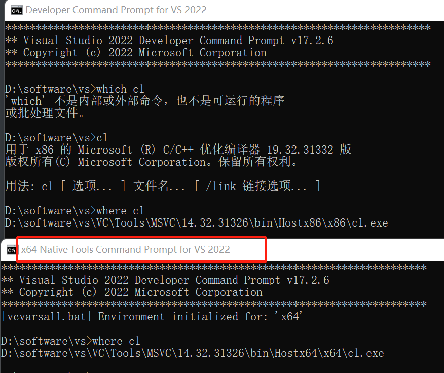
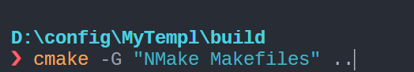
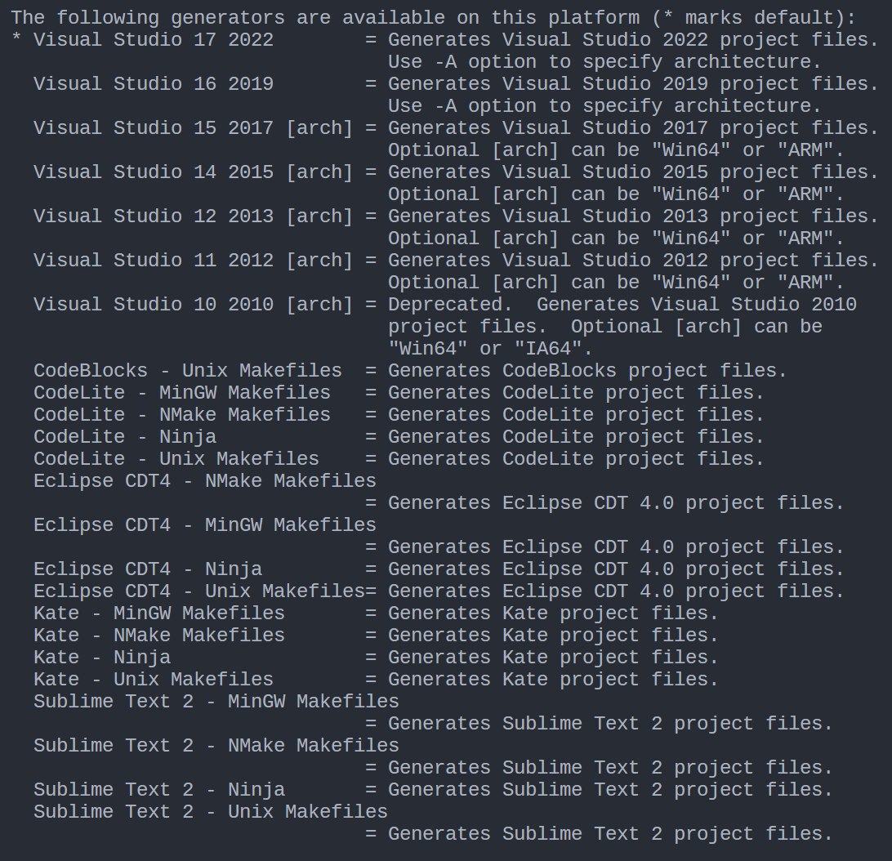
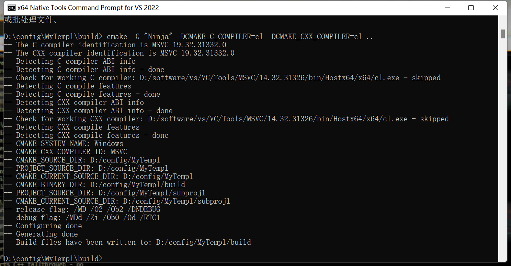

# cmake

> 官方文档: [cmake documentation](https://cmake.org/cmake/help/latest/index.html)

CMake 是一个管理源代码构建的工具。最初，CMake 被设计为一个生成各种 Makefile 方言(various dialects of Makefile)的生成器，如今 CMake 生成现代buildsystems（例如 Ninja）以及用于 IDE（例如 Visual Studio 和 Xcode）的项目文件。

CMake 广泛用于 C 和 C++ 语言，但它也可以用于构建其他语言的源代码。

## 常用path

- `CMAKE_SOURCE_DIR` : **顶级**`cmakelists.txt`的文件所在目录。
- `CMAKE_CURRENT_SOURCE_DIR` : 一般来说，一个工程会有多个cmakelists.txt文件，对应当前文件目录。
- `CMAKE_BINRAY_DIR` : 对应cmake的build的目录，主要是运行时生成的文件目录。
- `CMAKE_CURRENT_BINARY_DIR` : 对应build里的目录。
- `CMAKE_MODULE_PATH` : api(include/find_package)包含别的cmake文件时的搜索目录。
- `CMAKE_PREFIX_PATH` : api(find_libray/path)包含模块时的搜索目录。
- `CMAKE_INSTALL_PREFIX` : 调用install相关函数，要生成/保存的根目录路径。
- `CMAKE_EXPORT_COMPILE_COMMANDS=TRUE` : 如果使用clangd，需要将该选项设为true(似乎默认值也是true)，指定生成`compile_commands.json`文件。clangd依赖该文件做静态分析。
- `CMAKE_TOOLCHAIN_FILE` : 如果使用vcpkg，需要指定该路径(详见vcpkg文档)
- `CMAKE_UNITY_BUILD`：new in *3.16*；[CMAKE_UNITY_BUILD — CMake 3.25.1 Documentation](https://cmake.org/cmake/help/latest/variable/CMAKE_UNITY_BUILD.html)

<!-- ## 常用命令

- `target_compile_features`可以更细粒度的指定C++的特性，如`cxx_auto_type`，`cxx_lambda`等，如果某个子项目需要C++20，但是i项目整体是17，可以对项目设置`target_compile_features(<project name> INTERFACE cxx_std_20)` -->

## 常用flag

- `-G <generator-name>` 指定build system generator，如"Ninja"，“Unix Makefiles”
- `-T <toolset-spec>` 为generator指定Toolset, if supported. 只有Visual Studio，Xcode等支持这一选项

build flag

- `--target <tgt>..., -t <tgt>...` 指定target；默认target是all；`--target clean` 执行clean动作
- `--config <cfg>` 对于multi-configuration 工具链（VS Xcode）， 指定cfg，如`--config Debug/Release`

## 常用命令

- `list`，用于对list进行增删改查等操作

    例如，如果某个库没有提供用于查找该库的官方`cmake`脚本(用于module mode 的module 或者 config mode 的configuration文件)，则需要自己编写查找该库的cmake脚本 or 使用第三方提供的脚本，然后将脚本所在的文件夹加入`CMAKE_MODULE_PATH`；cmake在执行`find_package`时会优先使用module mode，执行`CMAKE_MODULE_PATH`下的对应module搜索该库

    而`CMAKE_MODULE_PATH`是一个列表，这就需要我们把自定义的脚本路径添加到`CMAKE_MODULE_PATH`中，让cmake找到该脚本，此时使用`list(APPEND CMAKE_MODULE_PATH <user-defined-module-path>)`

    ```cmake
    list(APPEND CMAKE_MODULE_PATH "${CMAKE_CURRENT_LIST_DIR}/CMake")
    ```

- `set`

- `option`

- `include`

- `aux_source_directory`

- `find_library`


## PUBLIC  PRIVATE INTERFACE

`target_*` 命令常用的有`target_link_libraries`，`target_include_directories`，`target_compile_definitions`等：

```cmake
target_compile_definitions(say-hello PUBLIC VERSION=4)
```

这条命令在预编译阶段之前插入宏 `#define VERSION 4`，其中`PUBLIC`表示这个宏对于`say-hello`这个库以**及link了`say-hello`这个库的模块**可见；如果是`PRIVATE`，则这个宏仅对`say-hello`可见；而`INTERFACE`与`PRIVATE`相反，设置为`INTERFACE`后，对于外部可见，而对于模块内部不可见。

再举一个例子，对于`target_include_directories`命令来说：
```cmake
# `PUBLIC` let all receivers accesss header files
target_include_directories(
  ${LIB_NAME} PUBLIC 
  ${PROJECT_SOURCE_DIR}/include
)
```

- 设置为`PUBLIC`，会将`${PROJECT_SOURCE_DIR}/include`目录下的头文件暴露给引用该库的其它project；
- 如果设置为`PRIVATE`，则该目录下的头文件对于引用该库的项目是不可见的；
- 如果设置为`INTERFACE`，则该目录下的头文件对于该项目不可见，对于引用该项目的其它project可见。

直观地来说`PUBLIC`会将某个属性向外"传播"，`PRIVATE`自己"独享"，`INTERFACE`只暴露给外部

- `target_include_directories` 设置为`PUBLIC`常用于库文件向外export 头文件
- `target_link_libraries` 通常设置为`PRIVATE`，使得开发该库时引用的第三方库对于引用该库的其它项目不可见(如开发一个库时用到的`Catch2`，`benchmark`，`fmt`等测试，调试用的库)
- `target_add_definitions` 用于添加宏定义
- `target_compile_options` 用于添加编译选项；例如`target_compile_options(${LIB_NAME} PRIVATE -maes)`，对于指定`target`在编译时使用aesni


## 依赖管理
> 官方文档: [Using Dependencies Guide](https://cmake.org/cmake/help/latest/guide/using-dependencies/index.html#guide:Using%20Dependencies%20Guide)

一个Project将经常依赖于其他 projects, assets, and artifacts。 CMake 提供了许多方法将依赖项引入构建。其中主要的方法是 `find_package()` 命令和 `FetchContent` 模块。

### header-only lib
如Boost，fmt等，这种库直接把头文件加入到当前工程头文件目录即可

### Using Pre-built Packages With `find_package()`
> [find_package — CMake Documentation](https://cmake.org/cmake/help/latest/command/find_package.html)


项目所需的package可能已经在用户系统的某个位置构建并可用。这个package可能是用cmake构建的，也可能是用其它方式构建的，甚至有可能是一个根本不需要构建的文件集合。cmake为这些场景提供了`find_package()`命令。

`find_package()`搜索众所周知的位置，以及项目或用户提供的其他路径。 它还支持package components and packages being optional。 该命令提供结果变量以允许项目根据是否找到包或特定组件来自定义其自己的行为。
```cmake
find_package(Catch2)
find_package(GTest REQUIRED)	# REQUIRED: 如果没找到: abort cmake configure
find_package(Boost 1.79 COMPONENTS date_time)
```
关于`find_package`和`find_library`：

> [cmake - Package vs Library - Stack Overflow](https://stackoverflow.com/questions/23832339/package-vs-library)
>
> Imagine you want to use zlib in your project, you need to find the header file `zlib.h`, and the library `libz.so` (on Linux). You can use the low-level cmake commands `find_path` and `find_library` to find them, or you can use `find_package(ZLIB)`. The later command will try to find out all what is necessary to use zlib. It can be extra macro definitions, or dependencies.
>
> **Update, more detail about `find_package`**: when the CMake command `find_package(SomeThing)` is called, [as in the documentation](https://cmake.org/cmake/help/v3.0/command/find_package.html), there are two possible modes that cmake can run:
>
> - the module mode (that searches for a file `FindSomeThing.cmake`)
> - or the config mode (that searches for a file named `SomeThingConfig.cmake`)
>
> For ZLIB, there is a module named `FindZLIB`, shipped with CMake itself (on my Linux machine that is the file `/usr/share/cmake/Modules/FindZLIB.cmake`). That module is a CMake script that uses the CMake API to search for ZLIB files in default locations, or ask the user for the location if it cannot be found automatically.

#### find_package 的搜索模式

1. **Module mode**
2. **Config mode**
3. **FetchContent redirection mode**(3.24之后引入)

### Downloading And Building From Source With `FetchContent`

> [FetchContent — CMake 3.24.2 Documentation](https://cmake.org/cmake/help/latest/module/FetchContent.html)


依赖项不一定have to be pre-built才能被 CMake 调用。 依赖项也可以作为主项目的一部分从源代码构建。 `FetchContent` 模块提供下载依赖项源代码并将其添加到主项目buildsystem的功能。 The dependency's sources will be built along with the rest of the main-project, just as though the sources were part of the main-project's own sources.

该模块主要包括以下几个命令：

1. `FetchContent_Declare` 描述如何添加(下载)依赖库，其Signature如下

    ```cmake
    FetchContent_Declare(
      <name>
      <contentOptions>...
      [SYSTEM]
      [OVERRIDE_FIND_PACKAGE | FIND_PACKAGE_ARGS args...]
    )
    ```

    主要用到的参数：`name` 声明下载库的名称，`contentOptions` 描述获取、更新外部库的方式（常用的有通过 Git 下载，通过 URL 下载等）

    ```cmake
    # it is advisable to use a hash for GIT_TAG rather than a branch or tag name. A commit hash is more secure and helps to confirm that the downloaded contents are what you expected.
    # eg:
    FetchContent_Declare(
      googletest	# 大小写不敏感
      GIT_REPOSITORY https://github.com/google/googletest.git
      GIT_TAG        703bd9caab50b139428cea1aaff9974ebee5742e # release-1.10.0
    )
    ```

    **使用时需要注意以下几点**

    - **多次调用`FetchContent_Declare`**：The `FetchContent_Declare()` function records the options that describe how to populate the specified content. If such details have already been recorded earlier in this project (regardless of where in the project hierarchy), this and all later calls for the same content `<name>` are ignored. This "first to record, wins" approach is what allows hierarchical projects to have parent projects override content details of child projects.

2. `FetchContent_MakeAvaliable` 让之前通过`FetchContent_Declare`声明的依赖变得可用（加入buildsystem中）

    **使用时需要注意以下几点**

    - **哪条命令会下载依赖**：调用`FetchContent_Declare`不下载依赖；真正的下载动作发生在调用`FetchContent_MakeAvaliable`时。

    - **离线（不通过下载）添加依赖**：可以通过指定本地路径的方式来添加依赖；通过设置`FETCHCONTENT_SOURCE_DIR_<uppercaseName>`变量来指定依赖在local fs的位置。这样在调用`FetchContent_MakeAvailable`时，就不会再从`Declare`中指定的网络位置下载源码。

        - `FETCHCONTENT_FULLY_DISCONNECTED` 变量默认为`OFF`，设置为`ON`时，不会进行任何下载和更新动作，当确定依赖已经存在于指定位置且不需要更新，可以设置为`ON`加速configure过程；
        - `FETCHCONTENT_UPDATES_DISCONNECTED`类似，只跳过更新阶段，如果依赖不存在，会去下载

        效果有点类似于`add_subdirectory`（但是不需要指定binary source directory）

        ```cmake
        set(FETCHCONTENT_SOURCE_DIR_FMT ${3RD_LIB_DIR}/fmt) # spicify `fmt` dir at local fs
        FetchContent_Declare(
          fmt
          GIT_REPOSITORY https://github.com/fmtlib/fmt.git
          GIT_TAG        48f525d025cadbedce0b2288ff8e19b6877341e4 # 9.1.0
        )
        FetchContent_MakeAvailable(fmt) # Won't download from github, add from local fs
        ```

    - **Declare与MakeAvaliable顺序**：第一次调用`FetchContent_MakeAvaliable`之后，再调用`FetchContent_Declare`会被忽略。因此，对于依赖的声明`FetchContent_Declare`**必须在第一次调用**`FetchContent_MakeAvaliable`之前。

        ```cmake
        # WRONG: Should declare all details first
        FetchContent_Declare(uses_other ...)
        FetchContent_MakeAvailable(uses_other)
        
        FetchContent_Declare(other ...)    # Will be ignored, uses_other beat us to it
        FetchContent_MakeAvailable(other)  # Would use details declared by uses_other
        #================================================================================
        # CORRECT: All details declared first, so they will take priority
        FetchContent_Declare(uses_other ...)
        FetchContent_Declare(other ...)
        FetchContent_MakeAvailable(uses_other other)
        ```

**一般的使用模式如下：**

- first declare all the dependencies it wants to use `FetchContent_Declare`
- then ask for them to be made available `FetchContent_MakeAvailable`

```cmake
FetchContent_Declare(
  catch2
  GIT_REPOSITORY https://github.com/catchorg/Catch2.git
  GIT_TAG        0de60d8e7ead1ddd5ba8c46b901c122eac20bf94 # 3.1.0
)
FetchContent_Declare(
  fmt
  GIT_REPOSITORY https://github.com/fmtlib/fmt.git
  GIT_TAG        48f525d025cadbedce0b2288ff8e19b6877341e4 # 9.1.0
)
FetchContent_MakeAvailable(catch2 fmt)  # 要求cmake 3.14以上
```
但是需要注意`FetchContent_MakeAvailable`是在3.14之后引入的，如果版本小于3.14，可以用如下命令手动populate依赖：

```cmake
FetchContent_GetProperties(catch2)
if(NOT catch2_POPULATED)
  FetchContent_Populate(catch2)
  add_subdirectory(${catch2_SOURCE_DIR} ${catch2_BINARY_DIR})
endif()
```

具体来说：

1. `FetchContent_Populate(<name>)`

    `FetchContent_MakeAvailable` 会先检查依赖是否已经构建完成，因此不会重复构建，但 `FetchContent_Populate` 并不会，重复构建会报错，因此， 使用 `FetchContent_Populate` 前，必须按照上述示例，使用 `FetchContent_GetProperties` 获取变量 `<lowercaseName>_POPULATED`，检测是否需要构建该依赖。

2. `FetchContent_GetProperties(<name> [SOURCE_DIR <srcDirVar>] [BINARY_DIR <binDirVar>] [POPULATED <doneVar>])`

### `FetchContent` and `find_package()` Integration

某些依赖项支持通过both `find_package()` and `FetchContent`两种方式添加到project。

项目可以通过使用 `FetchContent_Declare()` 的 `FIND_PACKAGE_ARGS` option 来表明it is happy to accept a dependency by either method(`FetchContent` and `find_package()`)。 这允许 FetchContent_MakeAvailable() 首先尝试通过调用 `find_package()` 来满足依赖关系，如果`find_package()`找到了的话，使用 FIND_PACKAGE_ARGS 关键字后面的参数。 如果没有找到依赖项，则它是从源代码构建，如前所述。
```cmake
include(FetchContent)
FetchContent_Declare(
  googletest
  GIT_REPOSITORY https://github.com/google/googletest.git
  GIT_TAG        703bd9caab50b139428cea1aaff9974ebee5742e # release-1.10.0
  FIND_PACKAGE_ARGS NAMES GTest
)
FetchContent_MakeAvailable(googletest)

add_executable(ThingUnitTest thing_ut.cpp)
target_link_libraries(ThingUnitTest GTest::gtest_main)
```
上面这个例子将会首先调用 `find_package(googletest NAMES GTest)`。 CMake 提供了一个 `FindGTest` Module，因此如果它发现某个地方安装了 GTest package，它将直接使其可用，并且不会从源代码构建依赖项(**也不会去下载源码了**)。如果没有找到 GTest 包，它将从下载源码，并从源代码构建。

### Dependency Providers
> [dependency provider](https://cmake.org/cmake/help/latest/command/cmake_language.html#dependency-providers)

开发人员可能对how a dependency is provided to the project更感兴趣。您可能希望使用自己构建的特定版本的包。您可能想要使用第三方包管理器。出于安全或性能原因，您可能希望将某些请求重定向到您控制的系统上的不同 URL。 CMake 通过 Dependency Providers 支持这些场景。

A dependency provider can be set to intercept `find_package()` and `FetchContent_MakeAvailable()` calls

## Windows使用cmake

在Windows平台下，`cl.exe`是visual c++的编译器，对应*nix平台下常见的`gcc` or `clang`；windows下的`link.exe`对应`ld`；通常在安装Visual Studio后，电脑上会有多个`cl.exe`，他们分别对应不同host架构和target架构：

<figure></figure>

但是如果从外部终端直接使用`cl.exe main.cpp`无法直接编译，因为`cl.exe`需要通过命令，或通过环境变量设置`include dir`。使用windows下这套编译链接工具最简单的方法是打开 X64 Native Tool Command Prompt for VS 2022，这个shell 预设置了这套工具运行所需要的环境变量（其它架构同理）。

如果想要从外部终端使用这套环境变量可以执行脚本 如：`vcvarsall.bat x64`(脚本的位置需要自己寻找)。

> 需要注意的是如果从powershell运行`.bat`脚本，则不会正确设置环境变量，这是因为powershell执行`.bat`脚本是通过开一个`cmd`子进程再执行脚本，执行完毕后`cmd`subprocess退出，设置的环境变量随之消失。
> 
> 如果想要在powershell中调用该脚本，一个方案是使用cmd启动`vcvars64.bat`脚本，再从cmd中启动powershell... 
> 
> [run vcvarsall, but cl and other still unavailable](https://stackoverflow.com/questions/65773728/run-vcvarsall-but-cl-and-other-still-unavailable)

### nmake

nmake是Microsoft Visual Studio中的附带命令行工具。**使用namke编译奇慢无比**，原因是namke不支持多任务编译，如非必要(openssl文档中指定使用nmake)，尽量不用这个工具。如果要使用`nmake`可以在cmake构建buildsystem 时指定使用`-G`参数指定generator为nmake：`cmake -G "NMake Makefiles"`

<figure></figure>

关于其它的构建系统可以使用`cmake --help`查看：

<figure></figure>

如图所示可以看到现在默认的generators是 **MSBuild**，这意味着我在`/build`下使用`cmake ..`时默认会生成`.sln`等我们熟悉的VS工程文件。

### MSBuild

MSBuild 是 Visual Studio 中所有项目（包括 C++ C# 项目）的native build system。 在 Visual Studio IDE 中构建项目时，它会调用 msbuild.exe，该工具又会使用 `.vcxproj` 项目文件以及各种 `.targets` 和 `.props` 文件。Visual Studio 依赖MSBuild，但是MSBuild不依赖Visual Studio。**MSBuild是nmake的替代品**。MSBuild所管理的工程文件（`.sln`，`.vcxprj`）使用的是xml语法。

如前文所述，在Windows上，cmake默认会选择MSBuild作为默认的build system generator，在命令行使用MSBuild的步骤：

```powershell
cd build
cmake ..
cmake --build . --config Release(默认是Debug)
```

我们经常看到的步骤是`cmake ..`之后`make`；这里使用`cmake --build .` 命令代替，这样即使是使用Ninja 或者 MSBuild 或者NMake Makefiles等不同generators生成的build tree 都可以被正确构建。

而我们常见的在`cmake ..`之后使用`make`其实是假设了使用`Unix Make`生成`build tree`，此时project files 主要是Makefile等，需要使用make去build。


### Ninja

```bash
 cd build
 cmake -G "Ninja" -DCMAKE_C_COMPILER=cl -DCMAKE_CXX_COMPILER=cl ..
 cmake --build . --config release
```

注意与nmake一样，这条命令执行必须要在有cl环境变量的shell中。一个直接的做法是使用 X64 Native Tool Command Prompt for VS 2022（其它版本，其它架构同理，下载VS后有对应的shell）；

<figure></figure>

在windows上使用ninja+clang：

```powershell
cmake -DCMAKE_EXPORT_COMPILE_COMMANDS=TRUE`
-DCMAKE_BUILD_TYPE=Release`
-DCMAKE_C_COMPILER=clang`
-DCMAKE_CXX_COMPILER=clang++`
-S. -Bbuild -GNinja
```

