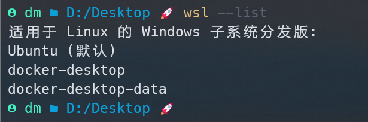
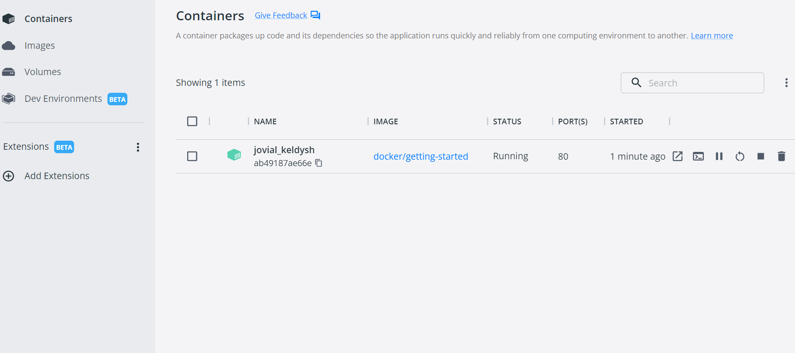
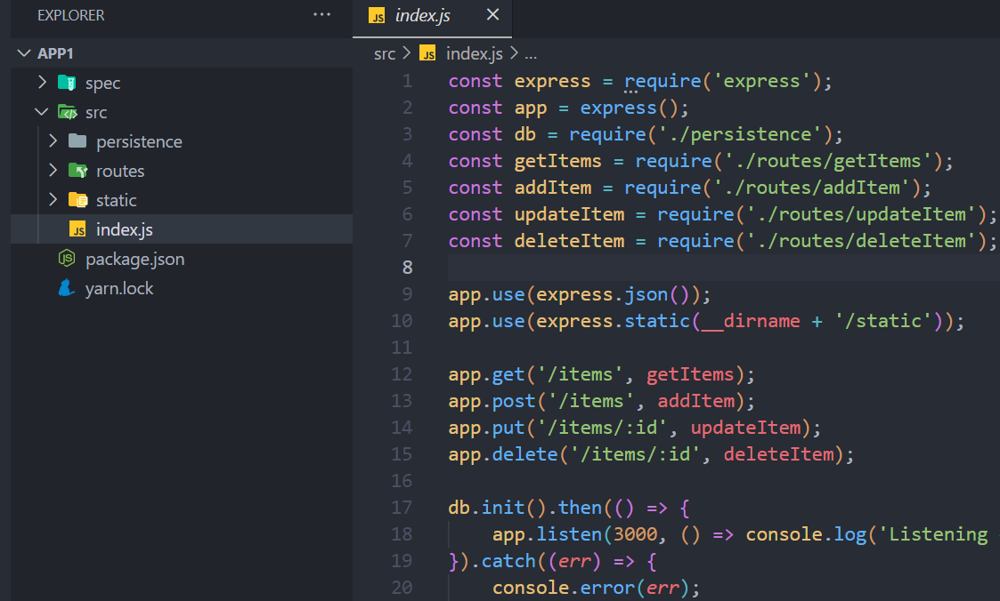
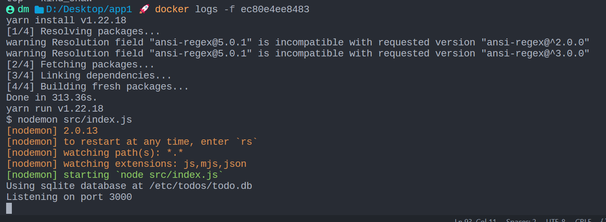
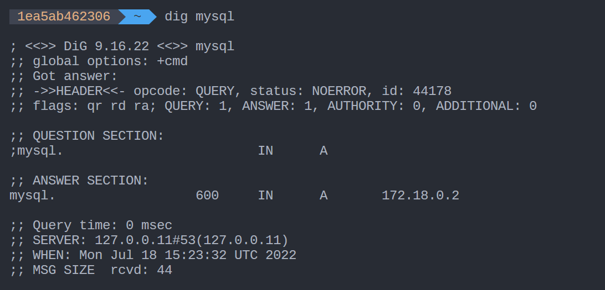
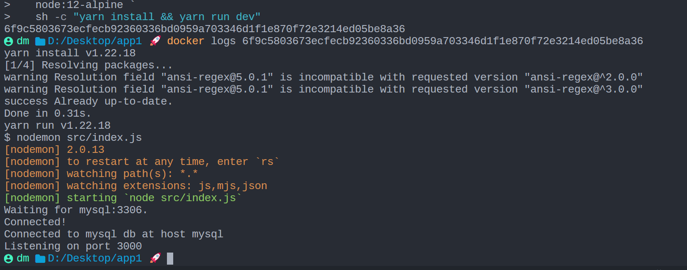
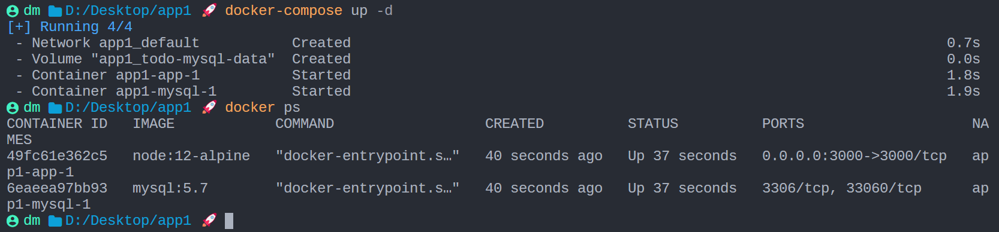

# Docker

更好的教程：[教程：开始在 Visual Studio Code 中使用 Docker 应用 | Microsoft Docs](https://docs.microsoft.com/zh-cn/visualstudio/docker/tutorials/docker-tutorial)

这个教程涵盖以下主题：

- 运行第一个容器
- 构建容器
- 了解正在运行的容器并删除它们
- 使用volumes做数据持久化
- Using bind mounts to support development 使用 bind mounts 来支持开发
- Using container networking to support multi-container applications 使用容器网络支持多容器应用
- Using Docker Compose to simplify the definition and sharing of applications 使用 Docker Compose 简化app的定义和共享
- Using image layer caching to speed up builds and reduce push/pull size 使用image layer caching来加速构建并减少 push/pull 大小
- Using multi-stage builds to separate build-time and runtime dependencies 使用多阶段构建来分离构建时和运行时依赖项

三个基本概念

- **镜像（Image）**
  类似于虚拟机中的镜像，是一个包含有文件系统的面向Docker engine的**只读模板**。任何应用程序运行都需要环境，而镜像就是用来提供这种运行环境的。例如一个Ubuntu镜像就是一个包含Ubuntu操作系统环境的模板，同理在该镜像上装上Apache软件，就可以称为Apache镜像。
- **容器（Container）**
  类似于一个轻量级的沙盒，可以将其看作一个极简的Linux系统环境（包括root权限、进程空间、用户空间和网络空间等），以及运行在其中的应用程序。Docker引擎利用容器来运行、隔离各个应用。容器是镜像创建的应用实例，可以创建、启动、停止、删除容器，各个容器之间是是相互隔离的，互不影响。**注意**：镜像本身是只读的，容器从镜像启动时，Docker在镜像的上层创建一个可写层，镜像本身不变。
- **仓库（Repository）**
  类似于代码仓库，这里是镜像仓库，是Docker用来集中存放镜像文件的地方。注意与注册服务器（Registry）的区别：注册服务器是存放仓库的地方，一般会有多个仓库；而仓库是存放镜像的地方，一般每个仓库存放一类镜像，每个镜像利用tag进行区分，比如Ubuntu仓库存放有多个版本（12.04、14.04等）的Ubuntu镜像。

## 存储管理

启用 WSL 后，Docker 运行数据都在 WSL 发行版中，因此镜像存储位置只能由 WSL 管理。

安装 Docker 后，Docker 会自动创建 2 个发行版：

- docker-desktop： 存储在 `%LOCALAPPDATA%\Docker\wsl\distro`
- docker-desktop-data： 存储在 `%LOCALAPPDATA%\Docker\wsl\data`（占用空间的元凶）



### 迁移docker数据存储位置

用 WSL 命令就可以简单实现迁移，操作步骤如下：

1. 停止 Docker 进程
2. 关闭所有发行版： `wsl --shutdown`
3. 导出 docker-desktop-data 发行版： `wsl --export docker-desktop-data D:\docker-desktop-data.tar`
4. 注销 docker-desktop-data 发行版： `wsl --unregister docker-desktop-data`
5. 导入 docker-desktop-data 到期望迁移的目录： `wsl --import docker-desktop-data D:\software\wsl\docker\data D:\docker-desktop-data.tar --version 2` （迁移目录 `D:\software\wsl\docker\data\` 可根据个人需求修改）
6. （可选）删除第 3 步导出的临时文件： `D:\wsl\docker\tmp\docker-desktop-data.tar`
7. （可选）另一个 Docker 发行版 docker-desktop 可使用同样方式迁移，但是其占用空间很小，不迁移亦可

> 迁移完成后可发现 `%LOCALAPPDATA%/Docker/wsl` 目录下的发行版文件已被删除， C 盘空间已释放

## 起步

### 起步例子

```
docker run -d -p 80:80 docker/getting-started
```

Docker在容器内运行应用程序。在一个容器内运行一个应用程序需要命令 `docker run`

上面这行命令：

- `-d` 指定容器在后台运行 (detached mode)
- `-p 80:80` 将主机的80端口映射到容器的80端口(**冒号前是host port ，后是container port**)
- `docker/getting-started` 指定使用该image，如果找不到此镜像，从docker hub拉取

> 上述命令可以把单个字符的flag缩写：`docker run -dp 80:80 docker/getting-started`

此时在浏览器访问`localhost:80`，就能打开该运行中的程序啦！

### The docker dashboard

在mac和windows上，docker dashboard可以更清晰的展示当前容器的运行状态，以及image信息等：



### 什么是container和image？

我们已经运行起来了一个容器，那么什么是容器？ 简而言之，容器只是您机器上的另一个进程，它与主机上的所有其他进程隔离。 这种隔离利用了kernel namespaces 和 cgroups——这些特性已经在 Linux 中存在了很长时间。 Docker 致力于使这些功能变得易于使用。

每个容器使用隔离的文件系统。 这个定制的文件系统由image提供。 由于镜像包含容器的文件系统，它必须包含运行应用程序所需的一切——所有依赖项、配置、脚本、二进制文件等。镜像还包含容器的其他配置，例如环境变量、运行的默认命令、 和其他元数据。

稍后我们将深入研究image，涵盖诸如分层、最佳实践等主题。

## 案例教程

接下来以一个 Node.js 的Todo-List 为例学习docker：从[getting-started/app at master · docker/getting-started · GitHub](https://github.com/docker/getting-started/tree/master/app) 下载示例app



### 创建app的container image

为了构建应用程序，我们需要使用 Dockerfile。 Dockerfile 是一个text-based 脚本，用于创建容器映像。 如果你之前创建过 Dockerfile，你可能会发现下面的 Dockerfile 中有一些缺陷，接下来我们会相应讨论。 

1. 在与文件 package.json 相同的文件夹中创建一个名为 Dockerfile 的文件，其内容如下：

   ```dockerfile
   # syntax=docker/dockerfile:1
   FROM node:12-alpine
   RUN apk add --no-cache python2 g++ make
   WORKDIR /app
   COPY . .
   RUN yarn install --production
   CMD ["node", "src/index.js"]
   EXPOSE 3000
   ```

   请确保 Dockerfile 没有像 `.txt` 这样的文件扩展名。 一些编辑器可能会自动附加此文件扩展名，这将导致下一步出错。

2. 在当前目录build container image：

   ```shell
   docker build -t getting-started .
   ```

   此命令使用 Dockerfile 脚本构建新的image。您可能注意到 a lot of “layers” were downloaded。这是因为我们指示builder我们要从 `node:12-alpine` image开始。但是，由于我们的机器上没有该image，因此需要下载该image。

   下载image后，COPY到我们的应用程序中并使用 yarn 来安装app的依赖。 CMD 指令指定从该映像启动容器时运行的默认命令。

   最后， `-t` 标志tag我们的image。可以将其简单地视为最终image的人类可读名称。由于我们将镜像命名为 `getting-started`，因此我们可以利用该名字在运行容器时引用该镜像。

   `.`在 docker build 命令的末尾告诉 Docker 它应该在当前目录中查找 Dockerfile。

### 使用创建的image

我们有了一个image，现在让我们运行该app。我们使用 `docker run` 命令来启动：

1. Start your container using the `docker run` command and specify the name of the image we just created:

   ```
   $ docker run -dp 3000:3000 getting-started
   ```

   Remember the `-d` and `-p` flags? We’re running the new container in “detached” mode (in the background) and creating a mapping between the host’s port 3000 to the container’s port 3000. Without the port mapping, we wouldn’t be able to access the application.

2. After a few seconds, open your web browser to [http://localhost:3000](http://localhost:3000/). You should see our app.

   

3. 继续添加一两个项目，看看它是否按预期工作。 你可以将item标记为完成并删除item。 前端成功将item存储在后端。 相当快速和容易，对吧？

接下来，我们将对我们的app进行修改，并学习如何使用新image更新正在运行的app。 在此过程中，我们将学习一些其他有用的命令。

### 更新容器

现在遇到一个需求，需要改动一行代码

1. 在 `src/static/js/app.js` 中, 更新第 56 行代码：

   ```
    -                <p className="text-center">No items yet! Add one above!</p>
    +                <p className="text-center">You have no todo items yet! Add one above!</p>
   ```

2. 然后让我们像之前一样build更新后的app镜像

   ```shell
    $ docker build -t getting-started .
   ```

3. 然后启动它

   ```shell
    $ docker run -dp 3000:3000 getting-started
   ```

**Uh oh!** You probably saw an error like this (the IDs will be different):

```
docker: Error response from daemon: driver failed programming external connectivity on endpoint laughing_burnell 
(bb242b2ca4d67eba76e79474fb36bb5125708ebdabd7f45c8eaf16caaabde9dd): Bind for 0.0.0.0:3000 failed: port is already allocated.
```

我们无法启动新容器，因为我们的旧容器仍在运行。 这是因为容器正在使用主机的 3000 端口，并且机器上只有一个进程（包括容器）可以监听特定端口。 为了解决这个问题，我们需要移除旧容器。

**替换old container**

为了替换掉旧的容器，我们要先将它停止运行：

```shell
$ docker ps						  # 查看正在运行的容器信息
$ docker stop <the-container-id>	# 停止正在运行的容器
$ docker rm <the-container-id>		# 删除old容器
```

> 后两句也可以简写为一条: `docker rm -f <the-container-id>`

虽然我们能够构建更新app，但您可能已经注意到两件事：

1. 我们待办事项列表中的所有现有项目都消失了！ 这不是一个很好的app！ 我们很快就会谈到这一点。
2. 这么小的更新涉及这么多步骤。 在接下来的部分中，我们将讨论如何在每次进行更改时无需重新构建和启动新容器即可查看代码更新。

在讨论数据持久化之前，我们将快速了解如何与他人共享这些image

### Share the app

要与他人共享image，必须使用Docker registry，Docker 默认的注册中心是Docker Hub，也正是i我们默认拉取image的地方。

// TODO

在本节中，我们学习了如何通过将image推送到注册表来共享image。

让我们回到我们在上一节末尾注意到的内容。 提醒一下，我们注意到当我们重新启动应用程序时，我们丢失了所有的待办事项列表项。 这显然不是一个很好的用户体验，所以让我们学习如何在重启后保留数据！

### Persist the DB

当一个容器运行时，它使用image中的各个layer作为其 filesystem。每个容器还有自己的“暂存空间”来创建/更新/删除文件。任何更改对于其他容器是不可见的——即使它们使用相同的image。

虽然容器可以创建、更新和删除文件，但当容器被remove并且所有更改都与该容器隔离时，这些更改会丢失。 Volume的出现使得数据持久化变得可能。

Volume提供了将container的特定文件系统挂载到host的能力。 如果容器中的目录已挂载，则对于容器的更改在host上可见。 如果我们在容器重启时挂载相同的目录，我们会看到相同的文件。

Volume有两种主要类型。 我们最终将同时使用两者，但我们将从 **named volumes**开始。

#### Persist the todo data

默认情况下，todo app把数据使用 SQLite 存在`/etc/todos/todo.db`中。如果我们可以把这个文件的数据保存到host中去，我们就能让下一个容器继续使用上一个容器的数据。通过创建一个volume，并将其挂载到存储数据的文件夹下，我们可以实现数据持久化。在本例中，这意味着`todo.db`文件会被持久化到host的volume中。

如同上面提到的，我们首先使用named volume，Docker维护这个volume在磁盘的物理位置，用户只需要记住这个volume的name。

1. 使用`docker volume create`创建一个volume

   ```shell
   $ docker volume create todo-db
   ```

2. 启动app 容器，并使用`-v`指定挂载的volume。在这里我们使用 named volume，并把它挂载到路径`/etc/todos`，他会捕获这个路径下创建的所有文件

   ```shell
   $ docker run -dp 3000:3000 -v todo-db:/etc/todos getting-started
   ```

3. 然后打开app，向todo list 中添加一些项

4. 使用`docker rm -f <id>`删除正在运行的这个容器

5. 启动一个新的容器，和刚才的容器使用同一个volume；可以看到新的容器打开后保留了上一个容器中的数据

#### 深入volume

很多人经常问，当我使用named volume时，docker究竟把我的数据存在了哪里？如果你想要指导，你可以使用 `docker volume inspect`来查看：

```shell
$ docker volume inspect todo-db
[
    {
        "CreatedAt": "2022-07-18T12:50:51Z",
        "Driver": "local",
        "Labels": {},
        "Mountpoint": "/var/lib/docker/volumes/todo-db/_data",
        "Name": "todo-db",
        "Options": {},
        "Scope": "local"
    }
]
```

`Mountpoint`是数据在磁盘上的真正位置，通常需要root权限来访问这些数据。

我们之前看到，为每次代码更改都重建image很费时间。 必须有更好的方法来解决。使用bind mounts是一个更好的解决方案。接下来一起来看。

### Use bind mounts

使用 bind mounts 我们可以控制容器中的文件在host中的真正挂载点（而不是向 named volume 一样交给Docker去决定）。同时也可以用来把主机的资源，比如源代码，挂载到container中，让容器即时的看到代码的变化并进行热更新。

对于Node程序而言，nodemon就是这样一个提供监控-热更新服务的程序。

为了让我们的容器支持开发工作流，我们需要做以下几件事情：

- 把我们的源代码挂载到container
- 在容器中安装所有的开发依赖
- 在容器中开启 nodemon 来监控fs的变化

接下来按照这个步骤执行：

1. 确保当前没有任何 getting-started 容器正在运行。

2. 在app目录运行以下命令：

   ```shell
   $ docker run -dp 8000:3000 \
        -w /app -v "$(pwd):/app" \
        node:12-alpine \
        sh -c "yarn install && yarn run dev"
   ```

   If you are using Windows then use this command in PowerShell:

   ```shell
    PS> docker run -dp 8000:3000 `
        -w /app -v "$(pwd):/app" `
        node:12-alpine `
        sh -c "yarn install && yarn run dev"
   ```

   - `-dp 3000:3000` 后台运行，将容器的3000port映射到host的8000
   - `-w /app` 设置工作目录
   - `-v "$(pwd):/app"` 将主机的当前目录挂载到容器中的`/app`目录
   - `node:12-alpine` 使用的image，注意这是Dockerfile中的base image
   - `sh -c "yarn install && yarn run dev"` 这条命令启动一个shell，然后 `yarn install` 安装所有依赖，然后 `yarn run dev`，在 `package.json`, 可以看到 `dev` 脚本将启动 `nodemon`

3. 你可以使用`docker logs`查看日志，You’ll know you’re ready to go when you see this:
   

4. 此时在host对于代码的任何更改都可以直接影响到容器中的程序

接下来，我们将使用关系数据库并将我们的app切换为使用 MySQL。接下来我们将看到，如何运行 MySQL， 如何允许容器相互通信。

### 多容器应用

承接上一节的问题，“我们在哪里运行MySQL？和app在同一个容器中还是单独的一个容器？” **In general, each container should do one thing and do it well.**理由如下：

- There’s a good chance you’d have to scale APIs and front-ends differently than databases
- 每个功能分配单独容器更方便管理版本
- 虽然您可以在本地为数据库使用容器，但您可能希望在生产环境中为数据库使用托管服务。 而不在app中发布你的数据库引擎。
- 运行多个进程将需要一个进程管理器（容器只启动一个进程），这增加了容器启动/关闭的复杂性

#### Container networking

**networking**是容器间通信的方式，如果两个容器在同一个网络，则它们可以通信，否则不可以。

有两种方法将容器们放在一个网络上：1）在一开始分配好；2）连接一个已存在的容器。现在我们将首先创建一个network并把MySQL容器在启动时分配到这个网络上。

1. 创建network：

   ```shell
   $ docker network create todo-app
   ```

2. 启动MySQL容器并把它attach到这个网络上：

   ```shell
   $ docker run -d \
        --network todo-app --network-alias mysql \
        -v todo-mysql-data:/var/lib/mysql \
        -e MYSQL_ROOT_PASSWORD=secret \
        -e MYSQL_DATABASE=todos \
        mysql:5.7
   ```

   If you are using Windows then use this command in `PowerShell`：

   ```shell
    PS> docker run -d `
        --network todo-app --network-alias mysql `
        -v todo-mysql-data:/var/lib/mysql `
        -e MYSQL_ROOT_PASSWORD=secret `
        -e MYSQL_DATABASE=todos `
        mysql:5.7
   ```

   > 命令中我们使用了named volume `todo-mysql-data` 挂载到 `/var/lib/mysql`, which is where MySQL stores its data. 但我们事先并没有运行 `docker volume create` . 事实上，Docker会意识到这一点，并为我们自动创建这个 named volume

3. 为了确认mysql容器在运行，我们连接到数据库进行验证：

   ```shell
   $ docker exec -it <mysql-container-id> mysql -u root -p
   ```

OK，现在我们得到了一个网络和在这个network上的MySQL容器，可接下来我们该怎么让app运行在同一个网络上，并且在网络上找到mysql呢？为了解决这一点，**我们将要使用 `nicolaka/netshoot` 容器：**

1. 使用 nicolaka/netshoot image启动一个新容器，确保它和mysql连接在同一个网络上：

   ```shell
   $ docker run -it --network todo-app nicolaka/netshoot
   ```

2. 在这个容器中，我们将要使用`dig`命令(一个DNS工具)，我们将使用这个工具来查找主机名为 `mysql`(在创建mysql 容器时指定的alias)的IP地址

   ```shell
   $ dig mysql
   ```

   

   在"ANSWER SECTION"可以看到将主机名解析到IP地址`172.18.0.2`，接下来就可以利用这个IP让app在网络上找到mysql数据库了！

**使用app连接mysql**

The todo app supports the setting of a few environment variables to specify MySQL connection settings. They are:

- `MYSQL_HOST` - the hostname for the running MySQL server
- `MYSQL_USER` - the username to use for the connection
- `MYSQL_PASSWORD` - the password to use for the connection
- `MYSQL_DB` - the database to use once connected

> 虽然使用 **环境变量** 来设置连接设置对于开发来说通常是可以的，但在生产中运行应用程序时，不应这么做！ Docker 的前安全主管 Diogo Monica 写了一篇[精彩的博客文章](https://diogomonica.com/2017/03/27/why-you-shouldnt-use-env-variables-for-secret-data/)来解释原因。
>
> 更安全的方式是使用container orchestration framework提供的secret support。 在大多数情况下，这些秘密作为文件挂载在正在运行的容器中。 您会看到许多应用程序（包括 MySQL image和todo app）也支持带有 `_FILE` 后缀的环境变量，以指向包含该变量的文件。
>
> 例如，设置 `MYSQL_PASSWORD_FILE` 变量将导致应用程序使用引用文件的内容作为连接口令。 Docker 没有做任何事情来支持这些环境变量。您的应用需要知道如何处理这些环境变量。

1. **Note**: for MySQL versions 8.0 and higher, make sure to include the following commands in `mysql`.

   ```shell
   mysql> ALTER USER 'root' IDENTIFIED WITH mysql_native_password BY 'secret';
   mysql> flush privileges;
   ```

2. 设置刚才提到的环境变量，并与mysql容器连接到同一网络：

   ```shell
   $ docker run -dp 3000:3000 \
      -w /app -v "$(pwd):/app" \
      --network todo-app \
      -e MYSQL_HOST=mysql \
      -e MYSQL_USER=root \
      -e MYSQL_PASSWORD=secret \
      -e MYSQL_DB=todos \
      node:12-alpine \
      sh -c "yarn install && yarn run dev"
   ```

   If you are using Windows then use this command in PowerShell:

   ```shell
    PS> docker run -dp 3000:3000 `
      -w /app -v "$(pwd):/app" `
      --network todo-app `
      -e MYSQL_HOST=mysql `
      -e MYSQL_USER=root `
      -e MYSQL_PASSWORD=secret `
      -e MYSQL_DB=todos `
      node:12-alpine `
      sh -c "yarn install && yarn run dev"
   ```

3. 查看日志：`docker logs <container-id>`连接成功：

   

如果您查看 Docker Dashboard，您会发现我们有两个应用程序容器正在运行。 但是，没有真正的迹象表明它们被组合在一个应用程序中。 我们很快就会看到如何让它变得更好！

### 使用 Docker Compose

Docker Compose 是一种用于帮助定义和共享多容器应用程序的工具。 使用 Compose，我们可以创建一个 `YAML` 文件来定义服务，并且使用一个命令，就可以启动所有内容或将其全部关闭。

使用 Compose 的最大优势是您可以在一个文件中定义app stack，将其保存在项目 repo 的根目录中，并且可以轻松地让其他人为您的项目做出贡献。 别人只需要克隆您的存储库并start the compose app。 **事实上，你现在可能会在 GitHub/GitLab 上看到不少项目正是这样做的。**

windows中，Docker-Desktop自带了Docker-Compose，**接下来首先创建 Compose file**

1. 在 app的根路径，创建一个`docker-compose.yml`

2. 在compose file中我们从定义 schema 版本开始。在大多数情况下，最好使用支持的最新版本。

   ```
   version: "3.7"
   ```

3. 接下来定义构成app的服务(容器)列表：

   ```
   version: "3.7"
   
   services:
   ```

   现在我们开始将一个service迁移到 compose file中，其实就是将之前的启动命令翻译成compose file中特定格式的语言：

   1. 对于app应用，首先定义service的入口点以及容器的镜像。你可以给service任意一个名字，这个name自动成为network的别名。

      ```shell
      PS> docker run -dp 3000:3000 `
        -w /app -v "$(pwd):/app" `
        --network todo-app `
        -e MYSQL_HOST=mysql `
        -e MYSQL_USER=root `
        -e MYSQL_PASSWORD=secret `
        -e MYSQL_DB=todos `
        node:12-alpine `
        sh -c "yarn install && yarn run dev"
      ```

      一般来说，`image`后跟随的是`command`字段，其他字段翻译成相应格式：

      ```yaml
      version: "3.7"
      
      services:
        app:
          image: node:12-alpine
          command: sh -c "yarn install && yarn run dev"
          ports:
            - 3000:3000
          working_dir: /app
          volumes:
            - ./:/app
          environment:
            MYSQL_HOST: mysql
            MYSQL_USER: root
            MYSQL_PASSWORD: secret
            MYSQL_DB: todos
      ```

   2. 接下来是 MySQL service

      ```shell
      PS> docker run -d `
        --network todo-app --network-alias mysql `
        -v todo-mysql-data:/var/lib/mysql `
        -e MYSQL_ROOT_PASSWORD=secret `
        -e MYSQL_DATABASE=todos `
        mysql:5.7
      ```

      我们将首先定义新服务并将其命名为 mysql，以便它自动获取网络的alias。 我们将继续并指定要使用的image。接着定义 volume映射，当我们使用`docker run`的时候，如果我们使用了未定义的 named volume，`docker run`会自动创建，然而在Compose中却并非如此。我们需要在最上层的`volumes`字段定义一个volume，然后在service config里指定要挂载的路径：

      ```yaml
      version: "3.7"
      
      services:
        app:
          image: node:12-alpine
          command: sh -c "yarn install && yarn run dev"
          ports:
            - 3000:3000
          working_dir: /app
          volumes:
            - ./:/app
          environment:
            MYSQL_HOST: mysql
            MYSQL_USER: root
            MYSQL_PASSWORD: secret
            MYSQL_DB: todos
      
        mysql:
          image: mysql:5.7
          volumes:
            - todo-mysql-data:/var/lib/mysql
          environment:
            MYSQL_ROOT_PASSWORD: secret
            MYSQL_DATABASE: todos
      
      volumes:
        todo-mysql-data:
      ```

接下来就是使用docker-compose运行：`docker-compose up -d`



您会注意到volume以及一个network已创建！ 默认情况下，Docker Compose 会自动为应用程序stack创建一个网络（这就是我们没有在 compose 文件中定义网络的原因）。

> 当app启动时，它实际上需要等待 MySQL 启动并准备好，然后再尝试连接它。 Docker 没有任何内置支持来等待另一个容器完全启动、运行和准备好，然后再启动另一个容器。因此这需要在app代码中进行相应处理，对于Node-based 项目，可以使用`wait-port`依赖项来处理。 其他语言/框架也存在类似的解决方案。

当你需要停止整个应用时，只需要执行`docker-compose down`，或者从Dashboard关闭。

> Removing Volumes
>
> 默认情况下, `docker-compose down`命令不会被删除 compose file中定义的named volumes。如果你想要删除volumes, 需要添加 `--volumes` flag.
>
> Docker Dashboard 同样**不会删除** volumes when you delete the app stack.