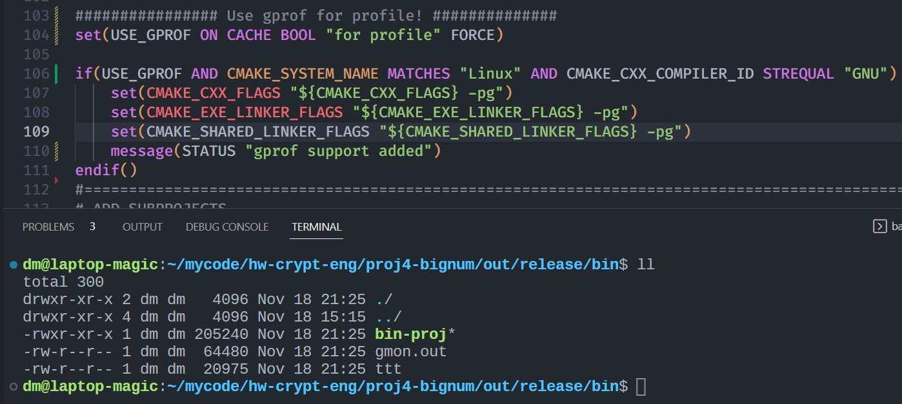

性能分析工具用于定位程序性能的消耗点，方便做出细致的优化。
常见的profile工具有Perf、gprof和Valgrind等。

## gprof
`gprof`是一个用于Unix系统下 user-space code的性能分析工具。`gprof`适合于查找用户级程序的性能瓶颈，对于很多时间都在内核态执行的程序，`gprof` 不适合（syscalls, waiting for CPU or I/O waiting等不会被监控到）

使用方法：

1. 在使用gcc(g++)**编译**时加上编译选项`-pg`会生成插桩代码，用于收集函数调用数据。
2. 在**链接**时加上链接选项`-pg`会动态链接到`preofiler`库，在二进制运行时动态采样。
3. **运行**被插桩后的程序，会自动生成一个`gmon.out`文件，保存采样数据信息。
4. 使用工具`gprof`(gcc toolchain中的一个工具)进行**分析**，会生成一个报告结果，由两部分组成：
   - the flat profile；对于每个函数，给出其执行时间占比，具体的执行时间，被调用次数等信息，排序后热点函数在最上方
   - the call graph；对于每个函数，显示出其caller和callee

### cmake集成

在项目顶层cmake中加入如下信息：


```cmake
if(USE_GPROF AND CMAKE_SYSTEM_NAME MATCHES "Linux" AND CMAKE_CXX_COMPILER_ID STREQUAL "GNU")
    set(CMAKE_CXX_FLAGS "${CMAKE_CXX_FLAGS} -pg")
    set(CMAKE_EXE_LINKER_FLAGS "${CMAKE_EXE_LINKER_FLAGS} -pg")
    set(CMAKE_SHARED_LINKER_FLAGS "${CMAKE_SHARED_LINKER_FLAGS} -pg")
    message(STATUS "gprof support added")
endif()
```

> 这里不使用更细粒度的`target_*`是因为如果一个项目由`bin`和`lib`两部分组成，而`bin`又依赖`lib`，仅对`bin`插桩，而不对`lib`插桩，会导致最终报告结果信息比较少；当然如果仅对某个二进制单独地profile，需要使用`target_*`
>
> ```
> if(USE_GPROF AND CMAKE_SYSTEM_NAME MATCHES "Linux" AND CMAKE_CXX_COMPILER_ID STREQUAL "GNU")
>     target_compile_options(${PROJECT_NAME} PRIVATE -pg)
>     target_link_options(${PROJECT_NAME} PRIVATE -pg)
>     target_compile_definitions(${PROJECT_NAME} PRIVATE USE_GPROF)
>     message(STATUS "gprof support added")
> endif()
> ```
>
> 当然如果直接依赖已经编译好的库文件，无法对库进行插桩（显然的）；

build得到可执行文件`bin-proj`，使用`gprof`分析采样结果得到文字分析报告：

```shell
gprof bin-proj gmon.out > res
```



得到报告，其中的callgraph部分如下图所示：


## gperftools

gperftools是google开源的profile工具。适用于Unix平台下的程序，在windows上工作很差。

**使用方法：**

1. 安装`google-perftools`

2. 程序链接动态库`-lprofiler`（或者在第3步中加上环境变量`LD_PRELOAD=/usr/lib/x86_64-linux-gnu/libprofiler.so`）

3. 执行命令：

   ```shell
   CPUPROFILE=main.prof CPUPROFILE_FREQUENCY=1000 ./bin-proj
   ```

4. 查看分析结果：

   ```shell
   google-pprof --svg bin-proj main.prof > res.svg	# 生成svg矢量图，还支持--pdf --text 等格式
   ```

**生成火焰图(flame graph)**

依赖 [brendangregg/FlameGraph: Stack trace visualizer (github.com)](https://github.com/brendangregg/FlameGraph)

```shell
google-pprof --collapsed bin-proj main.prof > main.0.cbt	# 使用 --collapsed 输出生成flame graph所需要的信息
~/download/FlameGraph/flamegraph.pl main.0.cbt > main.flame.0.svg
```

### cmake集成

[cmake:gperftools性能分析工具find libprofiler 脚本暨profiler的静态连接问题_10km的博客-CSDN博客](https://blog.csdn.net/10km/article/details/83796713)

[船长的资料室 - gperftools一行不改，多链个库，程序提速40% (tiger2doudou.com)](https://www.tiger2doudou.com/doku.php/coding:cpp:usage_and_cmake_of_gperftools)

> gperftools没有提供官方的用于查找profiler库的cmake脚本，所以在基于cmake管理的项目中如果要在系统查找libprofiler库就就要自己写FindPROFILER.cmake脚本。

大体上来说，首先通过`find_package`（依赖第三方脚本来寻找），或者简单的自己写一下`find_library`等，确认一下`libprofiler.so`的存在路径，然后链接上自己的程序即可；如果需要对特定的代码片段做profile，需要`google-perftools-dev`（Ubuntu上的名称），在程序中引入`#include <gperftools/profiler.h>`，把需要profile的代码段用特定函数夹起来，更高级的用法见官方文档[Gperftools CPU Profiler](https://gperftools.github.io/gperftools/cpuprofile.html)。

官方文档推荐的做法是在Dev过程中始终链接该库，方便做profile，在发布时取消链接即可。

### bonus

值得一提的是，gperftools不仅包含了上述的CPU profiler，还包含了大名鼎鼎的`tcmalloc`，一个heap-profiler，一个heap-checker，具体文档可见[Gperftools](https://gperftools.github.io/gperftools/)。

## perf

> [Perf Wiki (kernel.org)](https://perf.wiki.kernel.org/index.php/Main_Page)

 Linux profiling with performance counters.它涵盖了从CPU到软件层面各种时间的监控追踪能力，非常强大。

The userspace `perf` command present a simple to use interface with commands like:

- `perf stat`: 获取event计数
- `perf record`: record events for later reporting
- `perf report`: break down events by process, function, etc.
- `perf annotate`: annotate assembly or source code with event counts
- `perf top`: see live event count
- `perf bench`: run different kernel microbenchmarks


**使用方法**

```shell
perf record -F 500 -p $task_id -o perf.data -g sleep $time &
wait
## 参数
##record - Run a command and record its profile into perf.data
##-F，--freq= ，Profile at this frequency.
##-p， --pid=，Record events on existing process ID
##-o，--output=，Output file name.
##-g，--call-graph，Do call-graph (stack chain/backtrace) recording.
##sleep，采集时长，单位s
```

